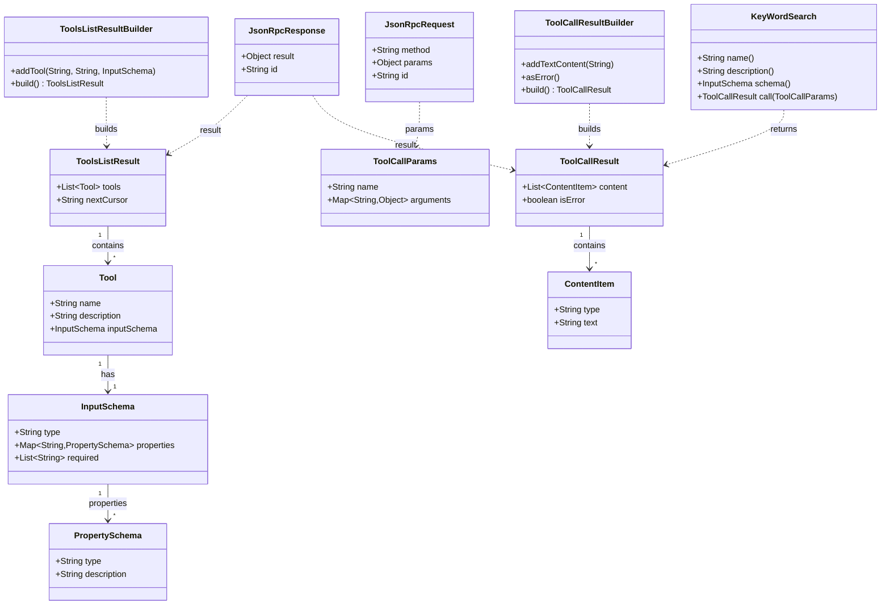

# MCP Class Diagram - Lesson 4: Tools Capability

This diagram shows only the classes and relationships used in lesson 4's Tools implementation.

## Key Class Groups in Lesson 4

### Tool Classes
- **Tool**: Defines a tool with name, description, and input schema
- **ToolsListResult**: Contains the list of available tools
- **InputSchema**: JSON Schema definition for tool parameters
- **ToolCallParams**: Parameters for executing a tool
- **ToolCallResult**: Result of tool execution with content items

### Builder Classes
Each major result type has a corresponding builder for type-safe construction:
- ToolsListResultBuilder, ToolCallResultBuilder

### Implementation Classes
- **KeyWordSearch**: The example tool implementation for searching keywords