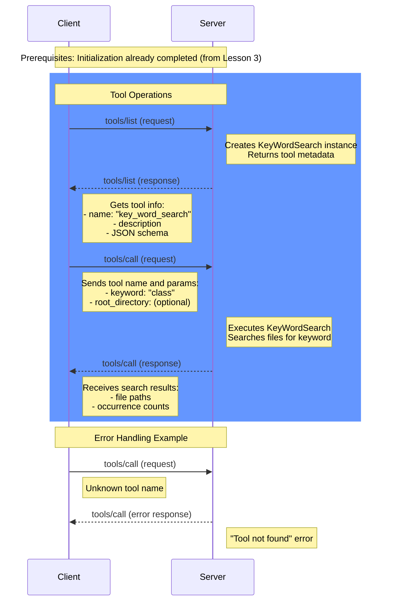

# MCP Message Flow - Lesson 4: Tools Capability

This diagram shows the message flow for the Tools capability implemented in lesson 4.

## Key Message Flows in Lesson 4

### Tools Flow
1. **List Tools**: Client discovers the KeyWordSearch tool and its schema
2. **Call Tool**: Client executes keyword search with parameters

### Error Handling
- Tools: Handles unknown tool names gracefully
- All responses include proper error messages for debugging