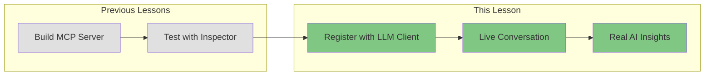
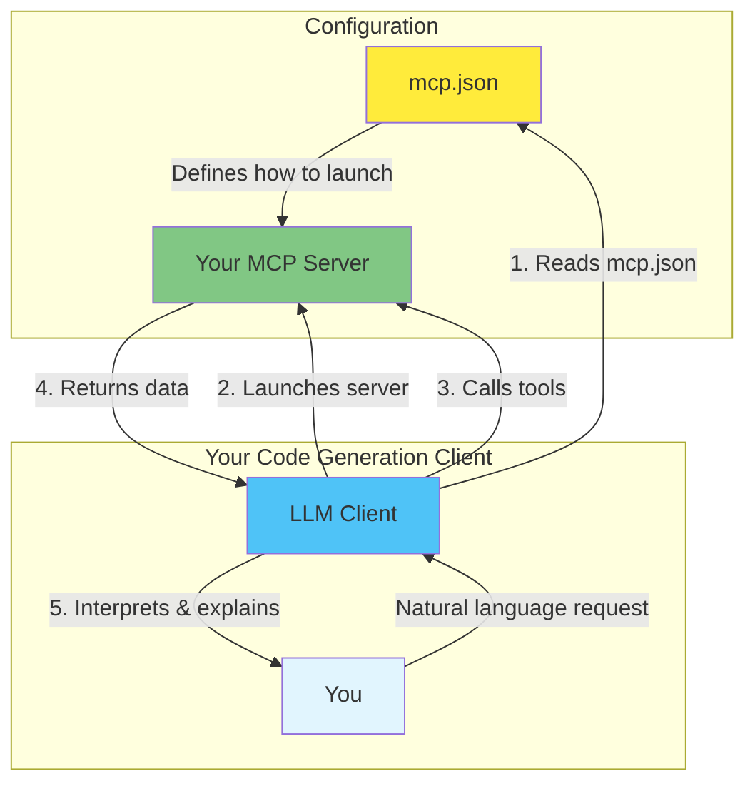
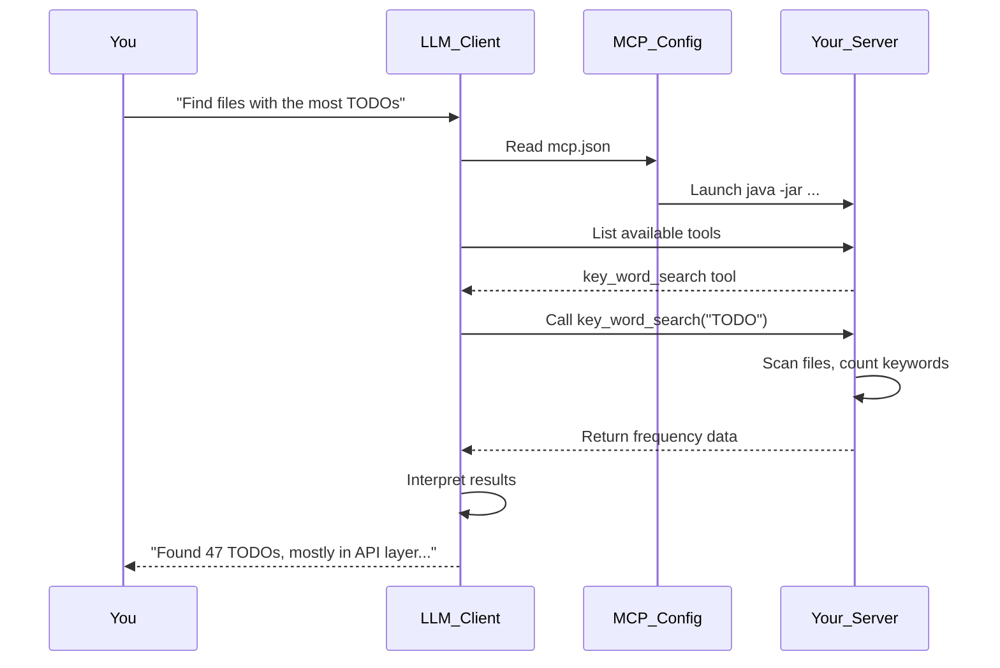

# Overview: Running Your MCP Server with a Live LLM

## The Complete Lifecycle: From Code to Conversation

Congratulations! You've built and tested your `key_word_search` MCP server using the MCP Inspector. Now it's time for the exciting part: connecting your MCP server to a **live LLM** and watching it work in a real conversation.

In this lesson, you'll use your favorite code generation client (Claude Code, Cursor, Windsurf, Cline, or any MCP-compatible tool) to register your newly written MCP server and see it run with a live LLM—not the Inspector anymore. This demonstrates the complete lifecycle of MCP development.

## What You'll Experience



## The Journey So Far

1. **Built**: Created an MCP server with the `key_word_search` tool
2. **Tested**: Verified it works using the MCP Inspector
3. **Now**: Connect it to a real LLM and have an actual conversation

## The Architecture: Your Tool + AI Reasoning



## Why This Matters

With the MCP Inspector, you manually tested individual tool calls. Now you'll see:

- **Natural Language**: Ask questions in plain English
- **Tool Selection**: The LLM decides when to use your tool
- **Interpretation**: Raw data becomes meaningful insights
- **Conversation**: Follow-up questions and deeper analysis

## What Your MCP Server Provides

Your `key_word_search` tool handles the predictable, deterministic work:

```json
{
  "keyword": "TODO",
  "results": [
    {"file": "src/main.java", "count": 12},
    {"file": "src/util.java", "count": 5}
  ]
}
```

## What the LLM Adds

The AI interprets, explains, and provides context:

> "I found 17 occurrences of 'TODO' across your project. Most are concentrated in `src/main.java` (12 occurrences), which suggests this file may have been written quickly and needs review. Would you like me to analyze the specific TODO comments?"

## Division of Responsibilities

### Your MCP Server Tool Handles:
- File system traversal
- Pattern matching and counting
- Data aggregation
- Structured data output
- Consistent, repeatable operations

### The LLM Handles:
- Understanding your intent
- Choosing when to use tools
- Interpreting raw data
- Applying domain knowledge
- Generating contextual insights
- Explaining "why" patterns exist

## Supported Code Generation Clients

You can use any MCP-compatible client:

| Client | MCP Config Location |
|--------|---------------------|
| **Claude Code** | `~/.claude/claude_desktop_config.json` or project `mcp.json` |
| **Cursor** | Settings → MCP Servers |
| **Windsurf** | `~/.codeium/windsurf/mcp_config.json` |
| **Cline** | VS Code extension settings |
| **Continue** | `~/.continue/config.json` |

## The Complete Lifecycle



## What You'll Do

1. **Configure**: Add your MCP server to your client's `mcp.json`
2. **Launch**: Start your code generation client
3. **Converse**: Ask questions that use your tool
4. **Observe**: Watch the complete lifecycle in action

## The Power of This Integration

This is what makes MCP powerful:

- **You built** a specialized tool that does one thing well
- **The LLM** knows when and how to use it
- **Together** they create an experience neither could provide alone

Your deterministic tool + AI reasoning = Actionable insights

## Next Steps

Follow the instructions to:
1. Create your `mcp.json` configuration
2. Register it with your chosen client
3. Have your first live conversation with your MCP server

You're about to see your code come to life in a real AI conversation!