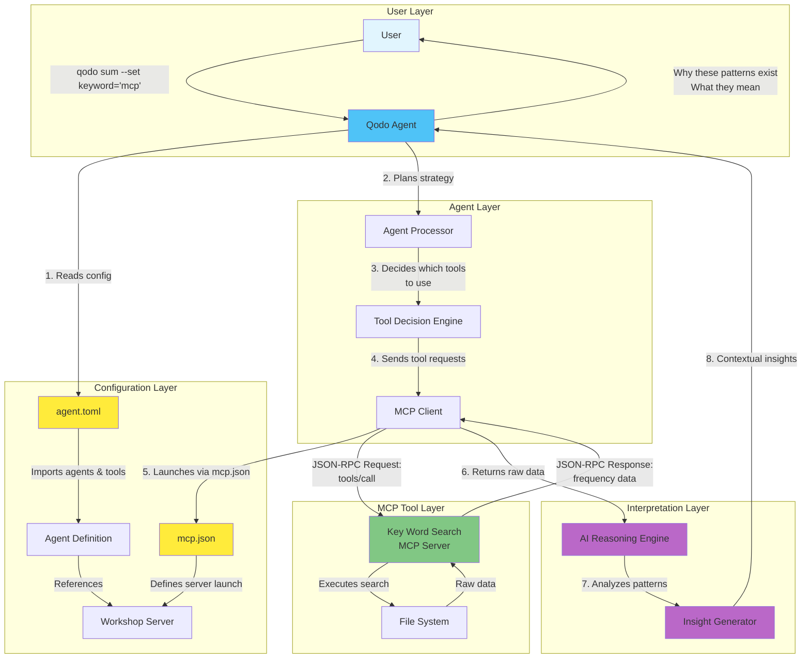
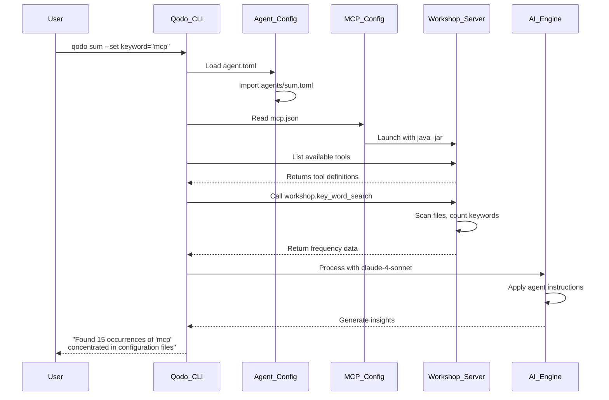

# Overview: Configuring MCP Server and Agent Setup

## Mission Accomplished: From Tool to Insight

Now that we've developed our `key_word_search` MCP server tool, we're ready to configure it for integration with AI agents. This overview explains how to set up the MCP server configuration and agent definitions, enabling the predictable capabilities of our MCP tool to combine with the interpretive reasoning of an AI agent to deliver meaningful insights about keyword patterns in codebases.

## The Configuration Architecture: Connecting Agents to MCP Servers

Before agents can use MCP tools, we need to establish the configuration that connects them. This involves two key files:

1. **`mcp.json`**: Defines how to launch and connect to MCP servers
2. **`agent.toml`**: Configures which tools agents can access

## The Architecture: Agent + Tool Collaboration



## Understanding the Components

### 1. **Configuration Files**

#### `mcp.json` - MCP Server Configuration
Defines how to launch your MCP server:
```json
{
  "mcpServers": {
    "workshop": {
      "command": "java",
      "args": ["-jar", "build/libs/agent-mcp-workshop-0.0.1.jar"],
      "env": {}
    }
  }
}
```

#### `agent.toml` - Agent Configuration
Connects agents to MCP servers and tools:
```toml
version = "1.0"
imports = ["agents/sum.toml"]
model = "claude-4-sonnet"
tools = ["workshop.key_word_search", "filesystem"]
```

### 2. **The Agent (Qodo Command Agent)**
Based on the configuration, an agent is:
- A **configurable AI-powered assistant** that performs tasks and automates workflows
- A **task-specific operator** with clear objectives and strategies
- Defined by instructions, arguments, and access to tools (MCPs)

Key Agent Concepts:
- **Instructions**: The prompt that defines the agent's behavior
- **Tools**: MCP servers the agent can utilize (like our `workshop.key_word_search`)
- **Model**: The AI model used (e.g., `claude-4-sonnet`)
- **Imports**: Agent definitions from the `agents/` directory

### 3. **The MCP Server Tool (key_word_search)**
Our tool handles:
- **Predictable Tasks**: Counting keywords, mapping file locations
- **Algorithmic Operations**: Frequency analysis, pattern detection
- **Data Collection**: Gathering raw information without interpretation

The tool provides:
```json
{
  "keyword_frequencies": {
    "TODO": 15,
    "FIXME": 8,
    "HACK": 3
  },
  "file_locations": {
    "TODO": ["src/main.java:45", "src/util.java:23"],
    "FIXME": ["src/api.java:67", "src/db.java:89"]
  }
}
```

### 4. **The Integration Flow**



## Division of Responsibilities

### MCP Server Tool Handles:
- ✅ File system traversal
- ✅ Pattern matching and counting
- ✅ Data aggregation
- ✅ Structured data output
- ✅ Consistent, repeatable operations

### AI Agent Handles:
- 🧠 Understanding user intent
- 🧠 Choosing appropriate tools
- 🧠 Interpreting raw data
- 🧠 Applying domain knowledge
- 🧠 Generating contextual insights
- 🧠 Explaining "why" patterns exist

## Configuration Setup Process

The setup involves three main steps:

### Step 1: Create MCP Server Configuration
Create `mcp.json` in the root directory to define how to launch your MCP server.

### Step 2: Create Agent Configuration
Create `agent.toml` in the root directory to:
- Import agent definitions from the `agents/` folder
- Specify the AI model to use
- Define which tools agents can access

### Step 3: Set Up Agent Definitions
Create the `agents/` directory and add agent TOML files (like `sum.toml`) that define specific agent behaviors.

## Example Agent Definition

Here's what a typical agent definition looks like (from `agents/sum.toml`):

```toml
# The agent's command name (invoked as: qodo sum)
[commands.sum]
description = "Summarizes keyword occurrences in the codebase"

instructions = """
You are a code analysis assistant. When given a keyword:
1. Use the workshop.key_word_search tool to find occurrences
2. Analyze the distribution across files
3. Provide a clear summary of findings
4. Highlight any patterns or concentrations
"""

# Arguments the agent accepts
[[commands.sum.arguments]]
name = "keyword"
description = "The keyword to search for"
required = true

# Tools available to this agent (inherited from agent.toml)
# Uses: workshop.key_word_search, filesystem
```

## The Power of Separation

This architecture demonstrates the power of separating concerns:

1. **Tools handle the "what"**: Collecting data, performing calculations
2. **Agents handle the "why"**: Interpreting meaning, providing context
3. **Together they deliver value**: Raw data becomes actionable insights

## Real-World Example

**User Command**: `qodo sum --set keyword="TODO"`

**Tool Response** (Raw Data from workshop.key_word_search):
```json
{
  "keyword": "TODO",
  "total_occurrences": 47,
  "files": {
    "src/api/UserController.java": 12,
    "src/api/AuthController.java": 16,
    "src/utils/DateHelper.java": 5,
    "src/models/User.java": 14
  }
}
```

**Agent Response** (Contextual Insight via claude-4-sonnet):
> "Found 47 occurrences of 'TODO' in your project, with a significant concentration in the API layer:
> 
> **API Controllers (28 TODOs - 60% of total)**
> - UserController.java: 12 occurrences
> - AuthController.java: 16 occurrences
> 
> This pattern suggests:
> 1. **Incomplete error handling** in your API endpoints
> 2. **Missing validation logic** that was deferred during initial development
> 3. **Technical debt accumulation** in the most user-facing parts of your application
> 
> The high concentration in authentication (AuthController) is particularly concerning as it affects security. Consider prioritizing these TODOs in your next sprint."

## Benefits of This Architecture

1. **Modularity**: Tools can be reused across different agents
2. **Maintainability**: Clear separation between data collection and interpretation
3. **Scalability**: New tools can be added without changing agent logic
4. **Reliability**: Deterministic tool behavior with intelligent agent adaptation
5. **Flexibility**: Agents can combine multiple tools for complex analyses

## Testing Your Configuration

After setting up your configuration files, you can test the integration:

```bash
# Ensure you're logged in to Qodo
qodo login

# Build your MCP server
./gradlew clean build

# Test your agent with the configured tool
./run_agent.sh
# Or manually: qodo sum --set keyword="mcp" --silent -y
```

## Next Steps

With our MCP server configuration and agent setup complete, we can now:

1. Create custom agents in the `agents/` directory for specific tasks
2. Add more tools to our MCP server and reference them in `agent.toml`
3. Experiment with different AI models by changing the `model` field
4. Build complex workflows by combining multiple tools

The configuration system we've established creates a bridge between:
- **Deterministic MCP tools** that gather data reliably
- **Intelligent AI agents** that interpret and provide insights
- **Flexible configurations** that allow easy customization and extension

This modular architecture enables us to build powerful, maintainable systems where specialized tools and intelligent agents work together to transform raw data into meaningful insights—completing our mission to understand not just what patterns exist in our code, but why they matter.