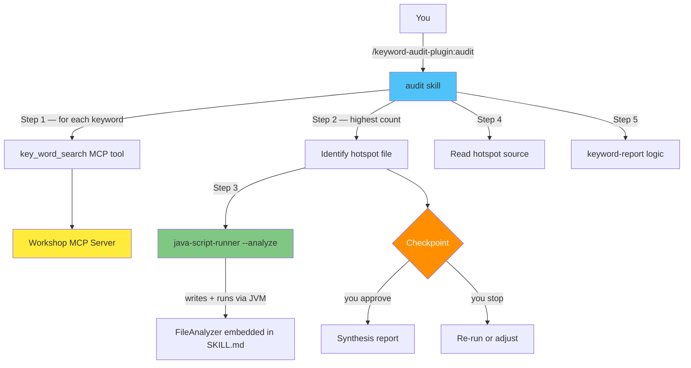
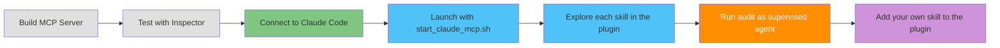

# Overview: Running Your MCP Server with a Live LLM

## From Inspector to Supervised Agent

You've built and tested your `key_word_search` MCP server. Now you'll connect it to a live LLM and extend it with a **Claude Code plugin** — a bundled set of skills that turns your MCP server into a supervised agent workflow.

## Skill vs Plugin — The Key Distinction

### What a Skill Is

A skill is a **directory** containing a single `SKILL.md` file. The directory name is the command name. Skills are installed globally to `~/.claude/skills/` and invoked as `/skill-name`.

```
~/.claude/skills/
└── keyword-search/         ← directory name = /keyword-search
    └── SKILL.md
```

```markdown
---
name: keyword-search
description: Search the codebase for a keyword using the workshop MCP server
---

Instructions Claude follows when /keyword-search is invoked...
```

### What a Plugin Is

A plugin is a **directory** containing a `.claude-plugin/plugin.json` manifest and a `skills/` subdirectory. It bundles multiple skills under a shared namespace. Skills inside a plugin are namespaced: `/plugin-name:skill-name`.

```
keyword-audit-plugin/
├── .claude-plugin/
│   └── plugin.json         ← required: plugin metadata
└── skills/
    ├── keyword-search/
    │   └── SKILL.md        ← /keyword-audit-plugin:keyword-search
    ├── keyword-report/
    │   └── SKILL.md        ← /keyword-audit-plugin:keyword-report
    ├── java-script-runner/
    │   └── SKILL.md        ← /keyword-audit-plugin:java-script-runner
    └── audit/
        └── SKILL.md        ← /keyword-audit-plugin:audit
```

| Aspect | Standalone Skill | Plugin |
|--------|-----------------|--------|
| Structure | `name/SKILL.md` | `.claude-plugin/plugin.json` + `skills/` |
| Command | `/skill-name` | `/plugin-name:skill-name` |
| Install | Copy to `~/.claude/skills/` | `--plugin-dir` (dev) or `/plugin install` |
| Scope | One command | Many skills, one namespace |

A skill is a single prompt-driven command. A plugin is a container that bundles multiple skills under one namespace, distributable as a unit.

## The Two-Folder Structure

The same pattern as earlier chapters: reference lives in `lesson/`, your working copy is at the project root.

```
agent-mcp-workshop/
├── lesson/keyword-audit-plugin/   ← reference — read from here
│   ├── .claude-plugin/
│   │   └── plugin.json
│   └── skills/
│       ├── keyword-search/SKILL.md
│       ├── keyword-report/SKILL.md
│       ├── java-script-runner/SKILL.md
│       └── audit/SKILL.md
│
└── keyword-audit-plugin/          ← your working copy — build here
    ├── .claude-plugin/
    │   └── plugin.json            ← manifest: name, version, skills path
    └── skills/
        ├── keyword-search/
        │   └── SKILL.md           ← data layer: calls key_word_search MCP tool
        ├── keyword-report/
        │   └── SKILL.md           ← analysis layer: groups by package, adds recommendations
        ├── java-script-runner/
        │   └── SKILL.md           ← execution layer: runs embedded Java via JVM
        └── audit/
            └── SKILL.md           ← orchestrator: supervised 6-step agent workflow
```

## The Four Skills

| Skill | Command | Layer | What It Does |
|-------|---------|-------|--------------|
| `keyword-search` | `/keyword-audit-plugin:keyword-search <kw>` | Data | Calls `key_word_search` MCP tool, returns sorted file list |
| `keyword-report` | `/keyword-audit-plugin:keyword-report <kw>` | Analysis | Groups by Java package, produces markdown report with recommendations |
| `java-script-runner` | `/keyword-audit-plugin:java-script-runner --analyze <path>` | Execution | Writes embedded FileAnalyzer Java source to temp file, runs via JVM, cleans up |
| `audit` | `/keyword-audit-plugin:audit` | Orchestration | Ties all three into a supervised 6-step workflow with checkpoint |

### How `java-script-runner` Carries Its Own Code

The `java-script-runner` SKILL.md has the full `FileAnalyzer` Java 21 source **embedded directly inside it**. When the `audit` skill reaches Step 3, Claude reads that embedded source, writes it to `/tmp/FileAnalyzer_$$.java`, runs it through the JVM, displays the output, and deletes the temp file. No external `.java` file exists anywhere on disk.

This technique — embedding executable source inside a skill's markdown — means the skill is completely self-contained and portable.

## The Supervised Audit Workflow



**Why the checkpoint matters**: A supervised agent automates multi-step work (five steps here) but pauses before the consequential output. You see all the evidence — search results, structural analysis, source code reasoning — before committing to the final report. This pattern is reusable: any multi-step skill with an approval gate is a supervised agent.

## Development Mode — No Global Install Required

The `start_claude_mcp.sh` script starts Claude Code with both the MCP server and the plugin loaded from the local project directory:

```bash
./start_claude_mcp.sh
```

Internally it runs:
```bash
claude --mcp-config .mcp-resolved.json --strict-mcp-config \
       --plugin-dir ./keyword-audit-plugin
```

`--plugin-dir` loads the plugin live from its source directory. Edit any `SKILL.md`, restart the session, and changes take effect immediately. No copy commands. No global installs.

> `.mcp-resolved.json` is a generated file that the script writes on startup (expanding `{YOUR_BASE}` to the real absolute path) and deletes on exit. You never edit it directly.

## What Three Layers Are Composing Here

```
MCP tool (data)  +  java-script-runner (JVM)  +  Read (source)  +  Claude (reasoning)
     ↓                      ↓                         ↓                  ↓
  what files         structural profile         actual code         why it matters
```

| Layer | Tool | Responsibility |
|-------|------|----------------|
| Data | MCP `key_word_search` | Deterministic file search, counts |
| Execution | `java-script-runner` + JVM | Structural analysis via embedded Java script |
| Reasoning | Claude Code | Reading source, understanding context, explaining *why* |

## The Lesson Lifecycle


