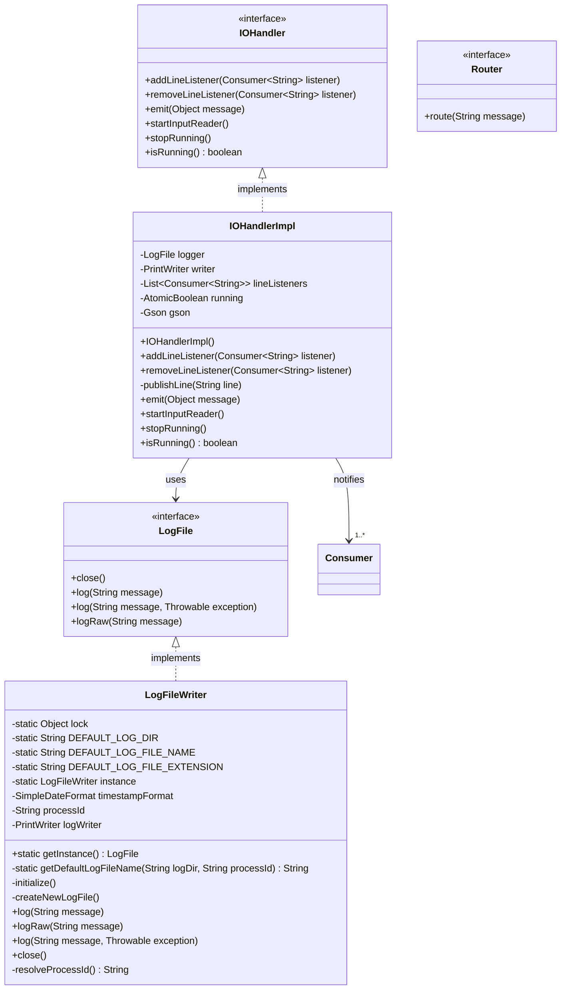
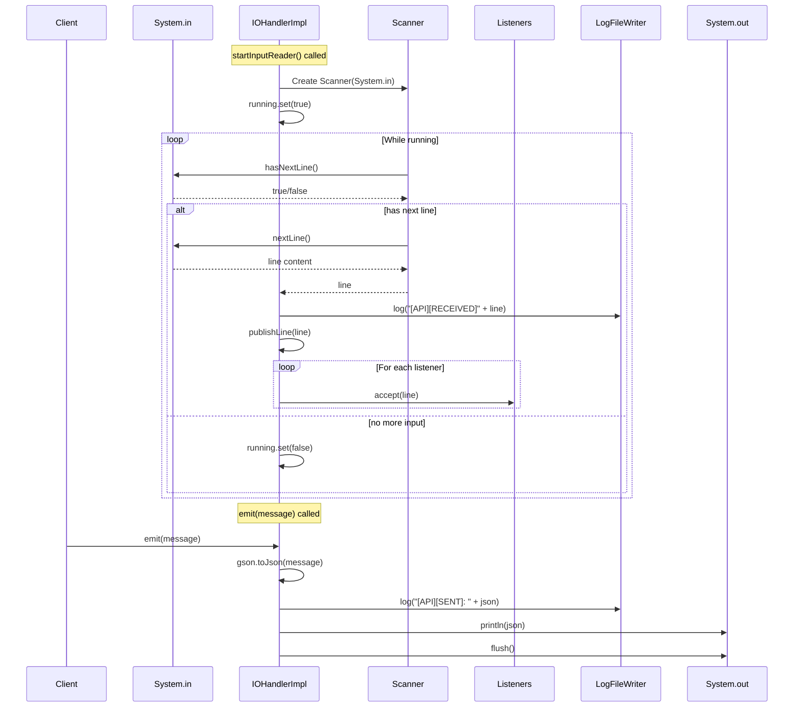

# Chapter 1: MCP Transport Layer - The Foundation

## Overview

This chapter introduces the foundational transport layer for the Model Context Protocol (MCP) implementation. The code we're examining represents the essential plumbing that enables bidirectional communication between MCP servers and clients. This transport layer is what we'll be building upon throughout this workshop.

## What is MCP Transport?

The Model Context Protocol (MCP) requires a reliable transport mechanism to exchange messages between servers and clients. Our implementation focuses on:

- **Bidirectional Communication**: Reading input streams and writing output streams
- **JSON Message Format**: All messages are serialized as JSON for interoperability
- **Event-Driven Architecture**: Using listeners and callbacks for asynchronous message handling
- **Robust Logging**: Comprehensive logging for debugging and monitoring

## Architecture Overview

The current codebase implements a clean, interface-driven architecture with clear separation of concerns:

### Core Components

1. **IOHandler Interface & Implementation**
   - Manages bidirectional I/O operations
   - Handles input reading on separate threads
   - Publishes events to registered listeners
   - Emits JSON-formatted output messages

2. **LogFile Interface & Implementation**
   - Provides comprehensive logging capabilities
   - Process-specific log file management
   - Thread-safe singleton pattern
   - Graceful error handling

3. **Router Interface**
   - Defines the contract for message routing
   - Will be implemented to handle different MCP message types

## Class Diagram



## Message Flow Diagram



## Technical Deep Dive

### IOHandlerImpl - The Communication Hub

The `IOHandlerImpl` class is the heart of our transport layer. Let's examine its key features:

#### Thread Safety
- Uses `CopyOnWriteArrayList` for thread-safe listener management
- `AtomicBoolean` for safe state management across threads
- Separate input reader thread prevents blocking

#### Input Processing
```java
public void startInputReader() {
    if (running.get()) {
        return; // Already running
    }
    
    try (Scanner scanner = new Scanner(System.in)) {
        running.set(true);
        while (running.get()) {
            if (!scanner.hasNextLine()) {
                running.set(false);
                break;
            }
            String line = scanner.nextLine();
            logger.log("[API][RECEIVED]" + line);
            publishLine(line);
        }
    }
}
```

Key aspects:
- Non-blocking design using a dedicated thread
- Graceful shutdown handling
- Comprehensive error handling and logging
- Event publication to all registered listeners

#### Output Handling
```java
public void emit(Object message) {
    String text = gson.toJson(message);
    logger.log("[API][SENT]: " + text);
    writer.println(text);
    writer.flush();
}
```

Features:
- Automatic JSON serialization using Gson
- Immediate flushing for real-time communication
- Logging of all outbound messages

### LogFileWriter - Robust Logging Infrastructure

The logging system implements several advanced patterns:

#### Singleton Pattern with Double-Checked Locking
```java
public static LogFile getInstance() {
    if (instance == null) {
        synchronized (lock) {
            if (instance == null) {
                instance = new LogFileWriter();
            }
        }
    }
    return instance;
}
```

#### Process-Specific Log Files
- Uses process ID in filename to avoid conflicts
- Automatic directory creation
- Fallback to system temp directory if needed

#### Error Resilience
- Logging failures don't propagate to the application
- Graceful degradation when file system is unavailable

### Router Interface - The Extension Point

The `Router` interface is intentionally minimal:
```java
public interface Router {
    void route(String message);
}
```

This will be the key extension point where we'll implement:
- Message type detection
- Protocol-specific routing logic
- Handler dispatch mechanisms

## Why This Architecture?

### Separation of Concerns
- **IOHandler**: Manages raw I/O operations
- **LogFile**: Handles logging independently
- **Router**: Will handle protocol-specific logic

### Extensibility
- Interface-based design allows easy testing and alternative implementations
- Listener pattern enables multiple consumers of input
- Clean abstraction boundaries

### Reliability
- Comprehensive error handling
- Thread-safe operations
- Graceful degradation

### Observability
- All messages logged with direction indicators
- Process-specific log files
- Detailed error logging with stack traces

## What's Next?

This transport layer provides the foundation for implementing the full MCP protocol. In upcoming chapters, we'll:

1. Implement the Router to handle different MCP message types
2. Add protocol-specific message parsing and validation
3. Build handlers for various MCP capabilities
4. Create a complete MCP server implementation

The beauty of this architecture is that the transport concerns are completely separated from the protocol logic. This clean separation will allow us to focus on MCP-specific features without worrying about the underlying I/O mechanics.

## Key Takeaways

1. **The transport layer is protocol-agnostic** - It simply moves JSON messages between processes
2. **Event-driven design enables flexibility** - Multiple components can react to incoming messages
3. **Robust error handling is crucial** - Network I/O is inherently unreliable
4. **Logging is your friend** - Comprehensive logging makes debugging distributed systems possible
5. **Thread safety matters** - Concurrent I/O requires careful synchronization

This foundation sets us up for success as we build out the complete MCP implementation in the following chapters.