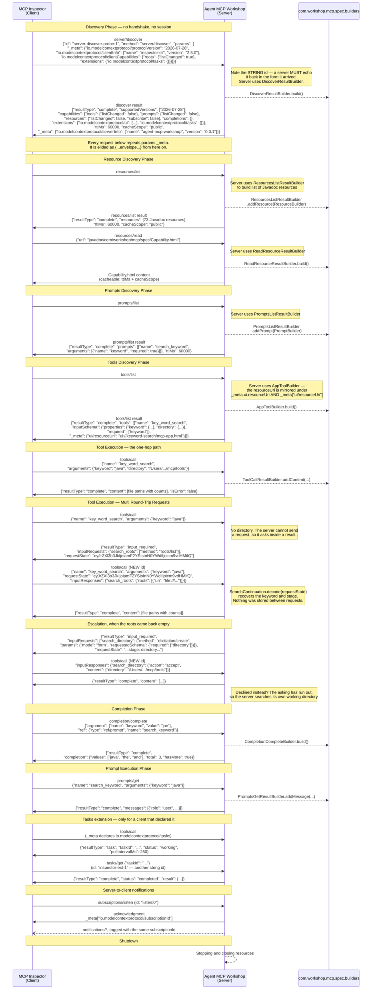

# MCP Json Communication Flow Diagram

```mermaid
sequenceDiagram
    participant Client as MCP Inspector<br/>(Client)
    participant Server as Agent MCP Workshop<br/>(Server)
    participant Builders as com.workshop.mcp.spec.builders

    Note over Client,Server: Discovery Phase — no handshake, no session

    Client->>Server: server/discover<br/>{"id": "server-discover-probe-1", "method": "server/discover", "params": {<br/>"_meta": {"io.modelcontextprotocol/protocolVersion": "2026-07-28",<br/>"io.modelcontextprotocol/clientInfo": {"name": "inspector-cli", "version": "2.5.0"},<br/>"io.modelcontextprotocol/clientCapabilities": {"roots": {"listChanged": true},<br/>"extensions": {"io.modelcontextprotocol/tasks": {}}}}}}

    Note right of Server: Note the STRING id — a server MUST echo<br/>it back in the form it arrived.<br/>Server uses DiscoverResultBuilder.
    Server-->>Builders: DiscoverResultBuilder.build()

    Server->>Client: discover result<br/>{"resultType": "complete", "supportedVersions": ["2026-07-28"],<br/>"capabilities": {"tools": {"listChanged": false}, "prompts": {"listChanged": false},<br/>"resources": {"listChanged": false, "subscribe": false}, "completions": {},<br/>"extensions": {"io.modelcontextprotocol/ui": {...}, "io.modelcontextprotocol/tasks": {}}},<br/>"ttlMs": 60000, "cacheScope": "public",<br/>"_meta": {"io.modelcontextprotocol/serverInfo": {"name": "agent-mcp-workshop", "version": "0.0.1"}}}

    Note over Client,Server: Every request below repeats params._meta.<br/>It is elided as {...envelope...} from here on.

    Note over Client,Server: Resource Discovery Phase

    Client->>Server: resources/list

    Note right of Server: Server uses ResourcesListResultBuilder<br/>to build list of Javadoc resources
    Server-->>Builders: ResourcesListResultBuilder<br/>.addResource(ResourceBuilder)

    Server->>Client: resources/list result<br/>{"resultType": "complete", "resources": [73 Javadoc resources],<br/>"ttlMs": 60000, "cacheScope": "public"}

    Client->>Server: resources/read<br/>{"uri": "javadoc/com/workshop/mcp/spec/Capability.html"}

    Note right of Server: Server uses ReadResourceResultBuilder
    Server-->>Builders: ReadResourceResultBuilder.build()

    Server->>Client: Capability.html content<br/>(cacheable: ttlMs + cacheScope)

    Note over Client,Server: Prompts Discovery Phase

    Client->>Server: prompts/list

    Note right of Server: Server uses PromptsListResultBuilder
    Server-->>Builders: PromptsListResultBuilder<br/>.addPrompt(PromptBuilder)

    Server->>Client: prompts/list result<br/>{"resultType": "complete", "prompts": [{"name": "search_keyword",<br/>"arguments": [{"name": "keyword", "required": true}]}], "ttlMs": 60000}

    Note over Client,Server: Tools Discovery Phase

    Client->>Server: tools/list

    Note right of Server: Server uses AppToolBuilder —<br/>the resourceUri is mirrored under<br/>_meta.ui.resourceUri AND _meta["ui/resourceUri"]
    Server-->>Builders: AppToolBuilder.build()

    Server->>Client: tools/list result<br/>{"resultType": "complete", "tools": [{"name": "key_word_search",<br/>"inputSchema": {"properties": {"keyword": {...}, "directory": {...}},<br/>"required": ["keyword"]},<br/>"_meta": {"ui/resourceUri": "ui://keyword-search/mcp-app.html"}}]}

    Note over Client,Server: Tool Execution — the one-hop path

    Client->>Server: tools/call<br/>{"name": "key_word_search",<br/>"arguments": {"keyword": "java", "directory": "/Users/.../mcp/tools"}}
    Server-->>Builders: ToolCallResultBuilder.addContent(...)
    Server->>Client: {"resultType": "complete", "content": [file paths with counts], "isError": false}

    Note over Client,Server: Tool Execution — Multi Round-Trip Requests

    Client->>Server: tools/call<br/>{"name": "key_word_search", "arguments": {"keyword": "java"}}

    Note right of Server: No directory. The server cannot send<br/>a request, so it asks inside a result.
    Server->>Client: {"resultType": "input_required",<br/>"inputRequests": {"search_roots": {"method": "roots/list"}},<br/>"requestState": "eyJrZXl3b3JkIjoiamF2YSIsInN0YWdlIjoicm9vdHMifQ"}

    Client->>Server: tools/call (NEW id)<br/>{"name": "key_word_search", "arguments": {"keyword": "java"},<br/>"requestState": "eyJrZXl3b3JkIjoiamF2YSIsInN0YWdlIjoicm9vdHMifQ",<br/>"inputResponses": {"search_roots": {"roots": [{"uri": "file:///..."}]}}}

    Note right of Server: SearchContinuation.decode(requestState)<br/>recovers the keyword and stage.<br/>Nothing was stored between requests.
    Server->>Client: {"resultType": "complete", "content": [file paths with counts]}

    Note over Client,Server: Escalation, when the roots came back empty

    Server->>Client: {"resultType": "input_required",<br/>"inputRequests": {"search_directory": {"method": "elicitation/create",<br/>"params": {"mode": "form", "requestedSchema": {"required": ["directory"]}}}},<br/>"requestState": "...stage: directory..."}
    Client->>Server: tools/call (NEW id)<br/>"inputResponses": {"search_directory": {"action": "accept",<br/>"content": {"directory": "/Users/.../mcp/tools"}}}
    Server->>Client: {"resultType": "complete", "content": [...]}

    Note right of Server: Declined instead? The asking has run out,<br/>so the server searches its own working directory.

    Note over Client,Server: Completion Phase

    Client->>Server: completion/complete<br/>{"argument": {"name": "keyword", "value": "jav"},<br/>"ref": {"type": "ref/prompt", "name": "search_keyword"}}
    Server-->>Builders: CompletionCompleteBuilder.build()
    Server->>Client: {"resultType": "complete",<br/>"completion": {"values": ["java", "the", "and"], "total": 3, "hasMore": true}}

    Note over Client,Server: Prompt Execution Phase

    Client->>Server: prompts/get<br/>{"name": "search_keyword", "arguments": {"keyword": "java"}}
    Server-->>Builders: PromptsGetResultBuilder.addMessage(...)
    Server->>Client: {"resultType": "complete", "messages": [{"role": "user", ...}]}

    Note over Client,Server: Tasks extension — only for a client that declared it

    Client->>Server: tools/call<br/>(_meta declares io.modelcontextprotocol/tasks)
    Server->>Client: {"resultType": "task", "taskId": "...", "status": "working",<br/>"pollIntervalMs": 250}
    Client->>Server: tasks/get {"taskId": "..."}<br/>(id: "inspector-ext-1" — another string id)
    Server->>Client: {"resultType": "complete", "status": "completed", "result": {...}}

    Note over Client,Server: Server-to-client notifications

    Client->>Server: subscriptions/listen (id: "listen:0")
    Server->>Client: acknowledgment<br/>_meta["io.modelcontextprotocol/subscriptionId"]
    Server--)Client: notifications/*, tagged with the same subscriptionId

    Note over Client,Server: Shutdown
    Server-->>Server: Stopping and closing resources
```
