# MCP Message Flow Diagram

```mermaid
sequenceDiagram
    participant Client
    participant Server

    Note over Client,Server: Discovery (no handshake, no session)
    Client->>Server: server/discover (request)
    Note right of Server: Answered from static config —<br/>on stdio a throwaway probe<br/>process may be the one asking
    Server-->>Client: result
    Note right of Server: Returns supportedVersions,<br/>capabilities, instructions,<br/>ttlMs/cacheScope, and serverInfo in _meta

    Note over Client,Server: Every request below carries params._meta:<br/>protocolVersion + clientCapabilities (required),<br/>clientInfo + logLevel (optional)

    rect rgb(100, 150, 255)
        Note over Client,Server: Tool Operations
        Client->>Server: tools/list (request)
        Server-->>Client: tools/list (response, ttlMs + cacheScope)
        Note right of Client: Gets available tools<br/>(e.g., key_word_search)

        Client->>Server: tools/call (request)
        Note right of Server: Executes tool with params
        Server-->>Client: tools/call (resultType: "complete")
    end

    rect rgb(255, 200, 100)
        Note over Client,Server: Multi Round-Trip Requests
        Client->>Server: tools/call (no directory argument)
        Server-->>Client: resultType: "input_required"
        Note right of Server: Embeds roots/list under<br/>inputRequests, plus an opaque<br/>requestState. A server MUST NOT<br/>send a request of its own.
        Client->>Server: tools/call (NEW id, inputResponses + requestState)
        Note right of Client: The retry is a brand new request,<br/>not a response
        Server-->>Client: resultType: "complete"
    end

    rect rgb(255, 150, 100)
        Note over Client,Server: Prompt Operations
        Client->>Server: prompts/list (request)
        Server-->>Client: prompts/list (response, cacheable)
        Note right of Client: Gets available prompts

        Client->>Server: prompts/get (request)
        Note right of Server: Expands prompt with args
        Server-->>Client: prompts/get (response)
    end

    rect rgb(100, 200, 100)
        Note over Client,Server: Resource Operations
        Client->>Server: resources/list (request)
        Server-->>Client: resources/list (response, cacheable)
        Note right of Client: Gets available resources

        Client->>Server: resources/read (request)
        Note right of Server: Reads resource content
        Server-->>Client: resources/read (response, cacheable)
    end

    rect rgb(200, 150, 50)
        Note over Client,Server: Completion Operations
        Client->>Server: completion/complete (request)
        Note right of Server: Provides completions
        Server-->>Client: completion/complete (response)
    end

    rect rgb(150, 100, 255)
        Note over Client,Server: Tasks extension (only if the client declared it)
        Client->>Server: tools/call
        Server-->>Client: resultType: "task" (a handle, unsolicited)
        Client->>Server: tasks/get (polling)
        Server-->>Client: status working → completed
    end

    rect rgb(120, 200, 180)
        Note over Client,Server: Server-to-client notifications
        Client->>Server: subscriptions/listen (long-lived request)
        Server-->>Client: acknowledgment tagged with subscriptionId
        Server--)Client: notifications/*, tagged with the same id
    end

    Client->>Server: notifications/cancelled
    Note right of Server: Operation cancelled
```

## Key Message Flow Rules:

1. **There Is No Initialization**:
   - `initialize` and `notifications/initialized` were removed in revision `2026-07-28`
   - `server/discover` can be called at any time and opens nothing
   - Any request may be the first request

2. **Every Request Carries Its Own Envelope**:
   - `params._meta` re-declares `protocolVersion` and `clientCapabilities` on **every** request — both required
   - `clientInfo` and `logLevel` are optional; with no `logLevel` the server must not emit `notifications/message`
   - Capability-dependent behaviour is therefore decided per request, not once at startup

3. **The Server Cannot Call the Client**:
   - A server MUST NOT send a request; modern clients silently discard inbound ones
   - `roots/list`, `sampling/createMessage`, and `elicitation/create` are now *embedded in a result* under `inputRequests`, and answered on a retry under `inputResponses`
   - The retry is a **new request with a new id**, correlated only by the echoed `requestState`

4. **Independent Operation Groups**:
   - **Tools**: `tools/list` → `tools/call`
   - **Prompts**: `prompts/list` → `prompts/get`
   - **Resources**: `resources/list` → `resources/read`
   - **Completion**: `completion/complete` (standalone)

5. **Notifications**:
   - Server-to-client notifications require an open `subscriptions/listen` stream and must be tagged with its `subscriptionId`
   - `notifications/cancelled`: indicates operation cancellation
   - `notifications/roots/list_changed` is gone — there is no session whose roots could change

6. **Dependencies**:
   - `tools/call` requires knowing available tools from `tools/list`
   - `prompts/get` requires knowing prompt names from `prompts/list`
   - `resources/read` requires knowing resource URIs from `resources/list`
   - The `key_word_search` tool takes an optional `directory`; omit it and the round trips above supply one

## Error Handling:
- Any request can return a `JsonRpcErrorResponse`
- A removed or unknown method returns `-32601` — removal in this revision is physical, an absence from the method registry
- A missing or incomplete `_meta` envelope returns `-32602`
- An unsupported `protocolVersion` returns `-32022`, whose `data` must carry both `requested` and `supported`
- Tool failures are **not** protocol errors: they come back as `isError: true` inside a successful result
