# MCP Message Flow Diagram

```mermaid
sequenceDiagram
    participant Client
    participant Server
    
    Note over Client,Server: Initialization Phase (Required)
    Client->>Server: initialize (request)
    Note right of Server: Server checks capabilities:<br/>- roots support<br/>- sampling support
    Server-->>Client: initialize (response)
    Note right of Server: Returns server capabilities<br/>and protocol version
    
    Client->>Server: notifications/initialized
    Note right of Server: Marks connection ready
    
    alt If client supports roots (hasRoots = true)
        Server->>Client: roots/list (request)
        Client-->>Server: roots/list (response)
        Note right of Server: Server stores root URIs
    end
    
    Note over Client,Server: Optional Operations (After Initialization)
    
    rect rgb(100, 150, 255)
        Note over Client,Server: Tool Operations
        Client->>Server: tools/list (request)
        Server-->>Client: tools/list (response)
        Note right of Client: Gets available tools<br/>(e.g., KeyWordSearch)
        
        Client->>Server: tools/call (request)
        Note right of Server: Executes tool with params
        Server-->>Client: tools/call (response)
    end
    
    rect rgb(255, 150, 100)
        Note over Client,Server: Prompt Operations
        Client->>Server: prompts/list (request)
        Server-->>Client: prompts/list (response)
        Note right of Client: Gets available prompts
        
        Client->>Server: prompts/get (request)
        Note right of Server: Expands prompt with args
        Server-->>Client: prompts/get (response)
    end
    
    rect rgb(100, 200, 100)
        Note over Client,Server: Resource Operations
        Client->>Server: resources/list (request)
        Server-->>Client: resources/list (response)
        Note right of Client: Gets available resources
        
        Client->>Server: resources/read (request)
        Note right of Server: Reads resource content
        Server-->>Client: resources/read (response)
    end
    
    rect rgb(200, 150, 50)
        Note over Client,Server: Completion Operations
        Client->>Server: completion/complete (request)
        Note right of Server: Provides completions
        Server-->>Client: completion/complete (response)
    end
    
    rect rgb(150, 100, 255)
        Note over Client,Server: Sampling Operations (if supported)
        Client->>Server: ping (request)
        Server-->>Client: ping (response)
        alt If hasSampling = true
            Server->>Client: sampling/createMessage (request)
            Note right of Client: Server initiates sampling
        end
    end
    
    Note over Client,Server: Notifications (Can occur anytime after init)
    
    Client->>Server: notifications/roots/list_changed
    Note right of Server: Triggers new roots/list request
    Server->>Client: roots/list (request)
    Client-->>Server: roots/list (response)
    
    Client->>Server: notifications/cancelled
    Note right of Server: Operation cancelled
```

## Key Message Flow Rules:

1. **Initialization is Required First**:
   - `initialize` request must be the first message
   - `notifications/initialized` must follow the initialize response
   - All other operations can only happen after initialization

2. **Capability-Dependent Flows**:
   - **Roots**: If client declares `roots` capability during initialization, server will request roots list
   - **Sampling**: If client declares `sampling` capability, server can send sampling messages (e.g., after ping)

3. **Independent Operation Groups** (after initialization):
   - **Tools**: `tools/list` → `tools/call`
   - **Prompts**: `prompts/list` → `prompts/get`
   - **Resources**: `resources/list` → `resources/read`
   - **Completion**: `completion/complete` (standalone)
   - **Ping**: Can trigger sampling if supported

4. **Notifications**:
   - `notifications/roots/list_changed`: Triggers server to request updated roots
   - `notifications/cancelled`: Indicates operation cancellation

5. **Dependencies**:
   - `tools/call` requires knowing available tools from `tools/list`
   - `prompts/get` requires knowing prompt names from `prompts/list`
   - `resources/read` requires knowing resource URIs from `resources/list`
   - Root-dependent operations (like KeyWordSearch tool) work better after roots are established

## Error Handling:
- Any request can return a `JsonRpcErrorResponse`
- Unknown methods return `NOT_FOUND` status
- Invalid parameters result in error responses