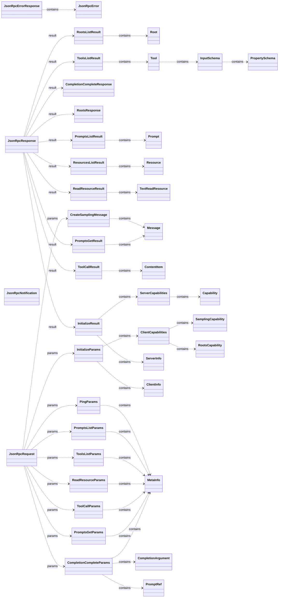

# High level Class Diagram for MCP (Model Context Protocol)

```mermaid
classDiagram
    direction LR
    
    %% JsonRpc Classes - Top Row
    class JsonRpcRequest
    class JsonRpcResponse
    class JsonRpcNotification
    class JsonRpcError
    class JsonRpcErrorResponse
    
    %% Core Protocol Classes - Second Row
    class InitializeResult
    class CreateSamplingMessage
    class CompletionCompleteResponse
    class RootsResponse
    class RootsListResult
    class Root
    
    %% Parameter Classes
    class InitializeParams
    class PromptsGetParams
    class ToolCallParams
    class ReadResourceParams
    class CompletionCompleteParams
    class ToolsListParams
    class PromptsListParams
    class PingParams
    
    %% Schema Classes - Left Side
    class InputSchema
    class PropertySchema
    
    %% Tool Classes - Center Left
    class ToolsListResult
    class ToolCallResult
    class Tool
    
    %% Prompt Classes - Center Right
    class Prompt
    class PromptsListResult
    class PromptsGetResult
    
    %% Resource Classes - Bottom Row
    class Resource
    class ResourcesListResult
    class ReadResourceResult
    class TextReadResource
    
    %% Additional Core Classes
    class Message
    class ContentItem
    class ServerCapabilities
    class ClientCapabilities
    class ServerInfo
    class ClientInfo
    class Capability
    class SamplingCapability
    class RootsCapability
    class MetaInfo
    class CompletionArgument
    class PromptRef
    
    %% Relationships to show grouping
    InputSchema ..> PropertySchema : contains
    PromptsListResult ..> Prompt : contains
    ResourcesListResult ..> Resource : contains
    JsonRpcErrorResponse ..> JsonRpcError : contains
    
    %% JsonRpcRequest can contain these in params field
    JsonRpcRequest ..> CreateSamplingMessage : params
    JsonRpcRequest ..> InitializeParams : params
    JsonRpcRequest ..> PromptsGetParams : params
    JsonRpcRequest ..> ToolCallParams : params
    JsonRpcRequest ..> ReadResourceParams : params
    JsonRpcRequest ..> CompletionCompleteParams : params
    JsonRpcRequest ..> ToolsListParams : params
    JsonRpcRequest ..> PromptsListParams : params
    JsonRpcRequest ..> PingParams : params
    
    %% JsonRpcResponse can contain these in result field
    JsonRpcResponse ..> CompletionCompleteResponse : result
    JsonRpcResponse ..> RootsResponse : result
    JsonRpcResponse ..> InitializeResult : result
    JsonRpcResponse ..> ToolsListResult : result
    JsonRpcResponse ..> ToolCallResult : result
    JsonRpcResponse ..> PromptsListResult : result
    JsonRpcResponse ..> PromptsGetResult : result
    JsonRpcResponse ..> ResourcesListResult : result
    JsonRpcResponse ..> ReadResourceResult : result
    JsonRpcResponse ..> RootsListResult : result
    
    %% Additional relationships discovered
    ToolsListResult ..> Tool : contains
    RootsListResult ..> Root : contains
    ReadResourceResult ..> TextReadResource : contains
    ToolCallResult ..> ContentItem : contains
    PromptsGetResult ..> Message : contains
    CreateSamplingMessage ..> Message : contains
    InitializeResult ..> ServerCapabilities : contains
    InitializeResult ..> ServerInfo : contains
    InitializeParams ..> ClientCapabilities : contains
    InitializeParams ..> ClientInfo : contains
    ServerCapabilities ..> Capability : contains
    ClientCapabilities ..> SamplingCapability : contains
    ClientCapabilities ..> RootsCapability : contains
    Tool ..> InputSchema : contains
    CompletionCompleteParams ..> MetaInfo : contains
    CompletionCompleteParams ..> CompletionArgument : contains
    CompletionCompleteParams ..> PromptRef : contains
    PromptsGetParams ..> MetaInfo : contains
    ToolCallParams ..> MetaInfo : contains
    ReadResourceParams ..> MetaInfo : contains
    ToolsListParams ..> MetaInfo : contains
    PromptsListParams ..> MetaInfo : contains
    PingParams ..> MetaInfo : contains
```
