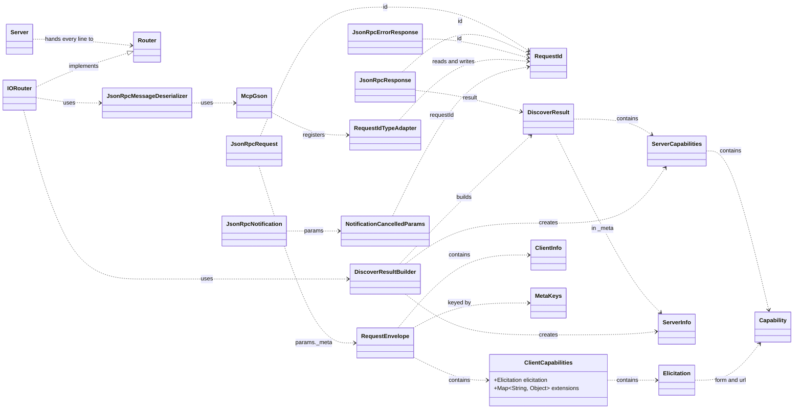

# Server Class Diagram

```mermaid
classDiagram
    direction LR

    %% JsonRpc Classes
    class JsonRpcRequest
    class JsonRpcResponse
    class JsonRpcNotification
    class JsonRpcErrorResponse

    %% Identity — an id is a string or a number
    class RequestId
    class RequestIdTypeAdapter
    class McpGson

    %% Core Protocol Classes
    class DiscoverResult
    class RequestEnvelope
    class NotificationCancelledParams

    %% Supporting Classes
    class ServerCapabilities
    class ClientCapabilities {
        +Elicitation elicitation
        +Map~String, Object~ extensions
    }
    class ServerInfo
    class ClientInfo
    class Capability
    class Elicitation
    class MetaKeys

    %% Server and related
    class Server
    class Router
    class IORouter
    class JsonRpcMessageDeserializer
    class DiscoverResultBuilder

    %% Relationships
    JsonRpcRequest ..> RequestId : id
    JsonRpcResponse ..> RequestId : id
    JsonRpcErrorResponse ..> RequestId : id
    RequestIdTypeAdapter ..> RequestId : reads and writes
    McpGson ..> RequestIdTypeAdapter : registers

    JsonRpcRequest ..> RequestEnvelope : params._meta
    JsonRpcResponse ..> DiscoverResult : result

    JsonRpcNotification ..> NotificationCancelledParams : params
    NotificationCancelledParams ..> RequestId : requestId

    DiscoverResult ..> ServerCapabilities : contains
    DiscoverResult ..> ServerInfo : in _meta

    RequestEnvelope ..> ClientCapabilities : contains
    RequestEnvelope ..> ClientInfo : contains
    RequestEnvelope ..> MetaKeys : keyed by

    ServerCapabilities ..> Capability : contains
    ClientCapabilities ..> Elicitation : contains
    Elicitation ..> Capability : form and url

    Server ..> Router : hands every line to
    IORouter ..|> Router : implements
    IORouter ..> JsonRpcMessageDeserializer : uses
    IORouter ..> DiscoverResultBuilder : uses
    JsonRpcMessageDeserializer ..> McpGson : uses

    DiscoverResultBuilder ..> DiscoverResult : builds
    DiscoverResultBuilder ..> ServerCapabilities : creates
    DiscoverResultBuilder ..> ServerInfo : creates
```
