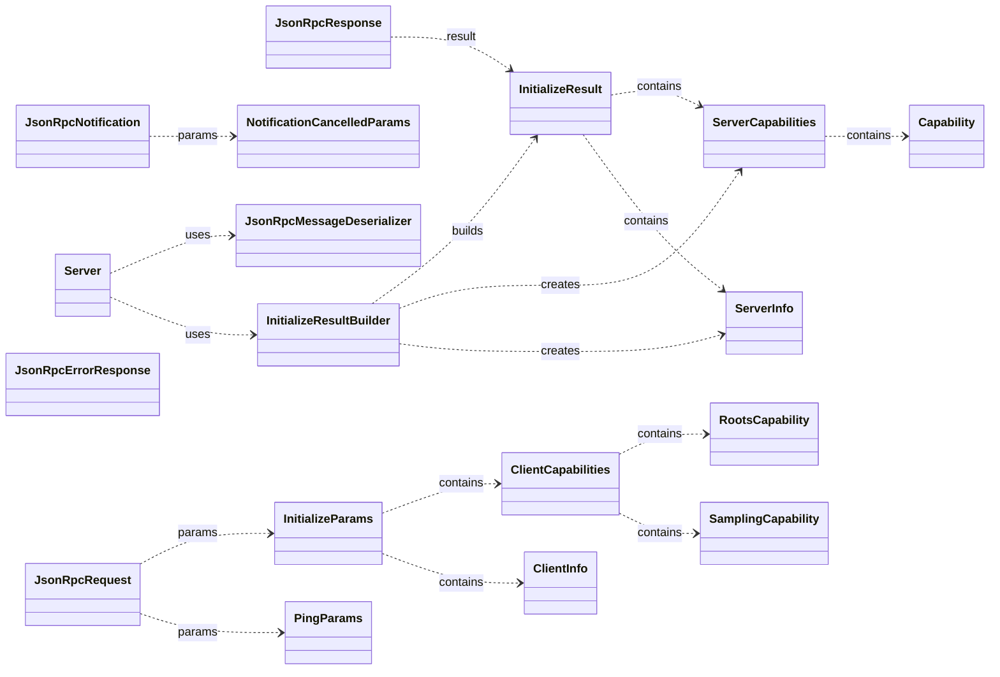

# Server Class Diagram 

```mermaid
classDiagram
    direction LR
    
    %% JsonRpc Classes
    class JsonRpcRequest
    class JsonRpcResponse
    class JsonRpcNotification
    class JsonRpcErrorResponse
    
    %% Core Protocol Classes
    class InitializeResult
    class InitializeParams
    class NotificationCancelledParams
    class PingParams
    
    %% Supporting Classes
    class ServerCapabilities
    class ClientCapabilities
    class ServerInfo
    class ClientInfo
    class Capability
    class RootsCapability
    class SamplingCapability
    
    %% Server and related
    class Server
    class JsonRpcMessageDeserializer
    class InitializeResultBuilder
    
    %% Relationships
    JsonRpcRequest ..> InitializeParams : params
    JsonRpcRequest ..> PingParams : params
    
    JsonRpcResponse ..> InitializeResult : result
    
    JsonRpcNotification ..> NotificationCancelledParams : params
    
    InitializeResult ..> ServerCapabilities : contains
    InitializeResult ..> ServerInfo : contains
    
    InitializeParams ..> ClientCapabilities : contains
    InitializeParams ..> ClientInfo : contains
    
    ServerCapabilities ..> Capability : contains
    ClientCapabilities ..> RootsCapability : contains
    ClientCapabilities ..> SamplingCapability : contains
    
    Server ..> JsonRpcMessageDeserializer : uses
    Server ..> InitializeResultBuilder : uses
    
    InitializeResultBuilder ..> InitializeResult : builds
    InitializeResultBuilder ..> ServerCapabilities : creates
    InitializeResultBuilder ..> ServerInfo : creates
```