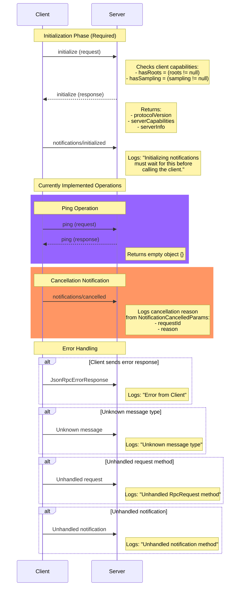

# Server Sequence Diagram 

```mermaid
sequenceDiagram
    participant Client
    participant Server
    
    Note over Client,Server: Initialization Phase (Required)
    
    Client->>Server: initialize (request)
    Note right of Server: Checks client capabilities:<br/>- hasRoots = (roots != null)<br/>- hasSampling = (sampling != null)
    Server-->>Client: initialize (response)
    Note right of Server: Returns:<br/>- protocolVersion<br/>- serverCapabilities<br/>- serverInfo
    
    Client->>Server: notifications/initialized
    Note right of Server: Logs: "Initializing notifications<br/>must wait for this before<br/>calling the client."
    
    Note over Client,Server: Currently Implemented Operations
    
    rect rgb(150, 100, 255)
        Note over Client,Server: Ping Operation
        Client->>Server: ping (request)
        Server-->>Client: ping (response)
        Note right of Server: Returns empty object {}
    end
    
    rect rgb(255, 150, 100)
        Note over Client,Server: Cancellation Notification
        Client->>Server: notifications/cancelled
        Note right of Server: Logs cancellation reason<br/>from NotificationCancelledParams:<br/>- requestId<br/>- reason
    end
    
    Note over Client,Server: Error Handling
    
    alt Client sends error response
        Client->>Server: JsonRpcErrorResponse
        Note right of Server: Logs: "Error from Client"
    end
    
    alt Unknown message type
        Client->>Server: Unknown message
        Note right of Server: Logs: "Unknown message type"
    end
    
    alt Unhandled request method
        Client->>Server: Unhandled request
        Note right of Server: Logs: "Unhandled RpcRequest method"
    end
    
    alt Unhandled notification
        Client->>Server: Unhandled notification
        Note right of Server: Logs: "Unhandled notification method"
    end
```