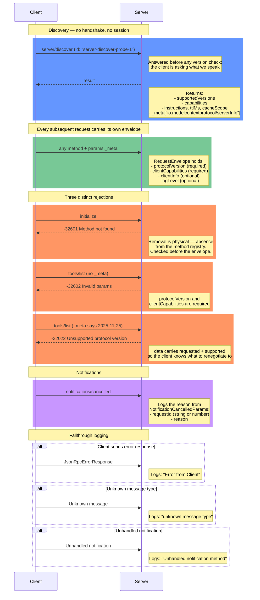

# Server Sequence Diagram

```mermaid
sequenceDiagram
    participant Client
    participant Server

    Note over Client,Server: Discovery — no handshake, no session

    rect rgb(100, 150, 255)
        Client->>Server: server/discover (id: "server-discover-probe-1")
        Note right of Server: Answered before any version check:<br/>the client is asking what we speak
        Server-->>Client: result
        Note right of Server: Returns:<br/>- supportedVersions<br/>- capabilities<br/>- instructions, ttlMs, cacheScope<br/>- _meta["io.modelcontextprotocol/serverInfo"]
    end

    Note over Client,Server: Every subsequent request carries its own envelope

    rect rgb(120, 200, 150)
        Client->>Server: any method + params._meta
        Note right of Server: RequestEnvelope holds:<br/>- protocolVersion (required)<br/>- clientCapabilities (required)<br/>- clientInfo (optional)<br/>- logLevel (optional)
    end

    Note over Client,Server: Three distinct rejections

    rect rgb(255, 150, 100)
        Client->>Server: initialize
        Server-->>Client: -32601 Method not found
        Note right of Server: Removal is physical — absence<br/>from the method registry.<br/>Checked before the envelope.
    end

    rect rgb(255, 150, 100)
        Client->>Server: tools/list (no _meta)
        Server-->>Client: -32602 Invalid params
        Note right of Server: protocolVersion and<br/>clientCapabilities are required
    end

    rect rgb(255, 150, 100)
        Client->>Server: tools/list (_meta says 2025-11-25)
        Server-->>Client: -32022 Unsupported protocol version
        Note right of Server: data carries requested + supported<br/>so the client knows what to renegotiate to
    end

    Note over Client,Server: Notifications

    rect rgb(200, 150, 255)
        Client->>Server: notifications/cancelled
        Note right of Server: Logs the reason from<br/>NotificationCancelledParams:<br/>- requestId (string or number)<br/>- reason
    end

    Note over Client,Server: Fallthrough logging

    alt Client sends error response
        Client->>Server: JsonRpcErrorResponse
        Note right of Server: Logs: "Error from Client"
    end

    alt Unknown message type
        Client->>Server: Unknown message
        Note right of Server: Logs: "unknown message type"
    end

    alt Unhandled notification
        Client->>Server: Unhandled notification
        Note right of Server: Logs: "Unhandled notification method"
    end
```
