# MCP Class Diagram - Lesson 4: Resources, Tools, and Prompts

This diagram shows only the classes and relationships used in lesson 4's implementation, as they exist on revision `2026-07-28`.

Three things about it are worth noticing before you read it:

- **Every result record starts with `resultType`.** It is required on the wire, and it is what tells the client whether it is holding a finished answer, a question, or a task handle.
- **Every *list* result also carries `ttlMs` and `cacheScope`.** Those are the cache hints, and the builders do not set them — the router restates the built result with them attached.
- **`id` is a `RequestId`**, not a `String` and not a `Long`, because a JSON-RPC id may be either and has to be echoed back in the form it arrived.

```mermaid
classDiagram
    direction TB

    %% Core JSON-RPC Classes (from lesson 3, used for all operations)
    class JsonRpcRequest {
        +String jsonrpc
        +RequestId id
        +String method
        +Object params
    }

    class JsonRpcResponse {
        +String jsonrpc
        +RequestId id
        +Object result
    }

    class RequestId {
        +String stringValue
        +Long numberValue
        +isString() boolean
    }

    %% Resource-related Classes
    class ResourcesListResult {
        +String resultType
        +List~Resource~ resources
        +String nextCursor
        +Long ttlMs
        +String cacheScope
    }

    class Resource {
        +String uri
        +String name
        +String description
        +String mimeType
        +Annotations annotations
    }

    class ReadResourceParam {
        +MetaInfo _meta
        +String uri
    }

    class ReadResourceResult {
        +String resultType
        +List~TextReadResource~ contents
        +boolean isError
        +Long ttlMs
        +String cacheScope
    }

    class TextReadResource {
        +String uri
        +String mimeType
        +String text
    }

    class ResourceTemplatesListResult {
        +String resultType
        +List~Object~ resourceTemplates
        +String nextCursor
        +Long ttlMs
        +String cacheScope
    }

    %% Tool-related Classes
    class ToolsListResult {
        +String resultType
        +List~ToolRecord~ tools
        +Long ttlMs
        +String cacheScope
    }

    class ToolRecord {
        +String name
        +String description
        +InputSchema inputSchema
    }

    class InputSchema {
        +String type
        +Map~String,PropertySchema~ properties
        +List~String~ required
    }

    class PropertySchema {
        +String key
        +String type
        +String description
        +boolean isRequired
    }

    class ToolCallParams {
        +MetaInfo _meta
        +String name
        +Map~String,String~ arguments
    }

    class ToolCallResult {
        +String resultType
        +List~ContentItem~ content
        +boolean isError
    }

    class ContentItem {
        +String text
        +String type
    }

    %% Prompt-related Classes
    class PromptsListResult {
        +String resultType
        +List~Prompt~ prompts
        +String nextCursor
        +Long ttlMs
        +String cacheScope
    }

    class Prompt {
        +String name
        +String description
        +List~PromptArgument~ arguments
    }

    class PromptArgument {
        +String name
        +String description
        +boolean required
    }

    class PromptsGetParams {
        +MetaInfo _meta
        +String name
        +Map~String,String~ arguments
    }

    class PromptsGetResult {
        +String resultType
        +String description
        +List~Message~ messages
    }

    class Message {
        +String role
        +MessageContent content
    }

    class MessageContent {
        +String text
        +String type
    }

    %% Builder Classes (used in implementation)
    class ResourcesListResultBuilder {
        +withResources(List~Resource~)
        +addResource(Resource)
        +withNextCursor(String)
        +build() ResourcesListResult
    }

    class ResourceBuilder {
        +withUri(String)
        +withName(String)
        +withDescription(String)
        +withMimeType(String)
        +build() Resource
    }

    class ReadResourceResultBuilder {
        +addTextContent(String, String, String)
        +asError()
        +build() ReadResourceResult
    }

    class ToolsListResultBuilder {
        +addTool(String, String, InputSchema)
        +build() ToolsListResult
    }

    class ToolCallResultBuilder {
        +addTextContent(String)
        +asError()
        +build() ToolCallResult
    }

    class PromptsListResultBuilder {
        +withPrompt(String, String)
        +withPromptArgument(String, String, boolean)
        +withNextCursor(String)
        +build() PromptsListResult
    }

    class PromptsGetResultBuilder {
        +withDescription(String)
        +addTextMessage(String, String, Map)
        +build() PromptsGetResult
    }

    %% Implementation Classes
    class JavadocResources {
        +loadAllHtmlResourcesFromFolder(String) List~Resource~
        +readResourceContent(String) String
    }

    class Tool {
        <<interface>>
        +name() String
        +description() String
        +schema() InputSchema
        +call(ToolCallParams, Set~String~) ToolCallResult
    }

    class KeyWordSearch {
        +name() String
        +description() String
        +schema() InputSchema
        +call(ToolCallParams, Set~String~) ToolCallResult
    }

    %% Relationships
    JsonRpcRequest --> RequestId : id
    JsonRpcResponse --> RequestId : id

    JsonRpcRequest ..> ReadResourceParam : params
    JsonRpcRequest ..> ToolCallParams : params
    JsonRpcRequest ..> PromptsGetParams : params

    JsonRpcResponse ..> ResourcesListResult : result
    JsonRpcResponse ..> ReadResourceResult : result
    JsonRpcResponse ..> ResourceTemplatesListResult : result
    JsonRpcResponse ..> ToolsListResult : result
    JsonRpcResponse ..> ToolCallResult : result
    JsonRpcResponse ..> PromptsListResult : result
    JsonRpcResponse ..> PromptsGetResult : result

    ResourcesListResult "1" --> "*" Resource : contains
    ReadResourceResult "1" --> "*" TextReadResource : contains

    ToolsListResult "1" --> "*" ToolRecord : contains
    ToolRecord "1" --> "1" InputSchema : has
    InputSchema "1" --> "*" PropertySchema : properties
    ToolCallResult "1" --> "*" ContentItem : contains

    PromptsListResult "1" --> "*" Prompt : contains
    Prompt "1" --> "*" PromptArgument : has
    PromptsGetResult "1" --> "*" Message : contains
    Message "1" --> "1" MessageContent : content

    ResourcesListResultBuilder ..> ResourcesListResult : builds
    ResourceBuilder ..> Resource : builds
    ReadResourceResultBuilder ..> ReadResourceResult : builds
    ToolsListResultBuilder ..> ToolsListResult : builds
    ToolCallResultBuilder ..> ToolCallResult : builds
    PromptsListResultBuilder ..> PromptsListResult : builds
    PromptsGetResultBuilder ..> PromptsGetResult : builds

    JavadocResources ..> Resource : creates
    Tool <|.. KeyWordSearch : implements
    KeyWordSearch ..> ToolCallResult : returns
```

## Key Class Groups in Lesson 4

### Resource Classes
- **Resource**: A single documentation file with URI, name, description, MIME type, and optional annotations
- **ResourcesListResult**: The list of available resources, plus cache hints
- **ReadResourceParam**: Request parameter carrying the URI to read
- **ReadResourceResult**: The content of one resource, with an `isError` flag for read failures
- **TextReadResource**: The text content with its URI and MIME type
- **ResourceTemplatesListResult**: Answered as empty, because clients ask for it whenever a server declares any resource capability

### Tool Classes
- **Tool** (shown as `ToolRecord` above): a tool with name, description, and input schema. Chapter 6 adds `_meta` and an `AppTool` for the UI association
- **ToolsListResult**: The list of available tools, plus cache hints
- **InputSchema**: JSON Schema definition for tool parameters
- **PropertySchema**: One property in that schema. Note `key` and `isRequired` are bookkeeping for the builder and are deliberately *not* serialized — a custom `TypeAdapter` writes only `type` and `description`, because anything else would not be valid JSON Schema
- **ToolCallParams**: Parameters for executing a tool. `arguments` is `Map<String, String>`, so a tool receives its arguments already flattened to strings
- **ToolCallResult**: Result of tool execution. No cache hints: a search result is not reusable

### Prompt Classes
- **Prompt**: A prompt template with its arguments
- **PromptsListResult**: The list of available prompts, plus cache hints
- **PromptArgument**: One prompt argument and whether it is required
- **PromptsGetParams**: Parameters for expanding a prompt
- **PromptsGetResult**: The expanded prompt as guided messages
- **Message** / **MessageContent**: A role and its typed content. There is one `Message` record rather than a `UserMessage` / `AssistantMessage` hierarchy — the role is a field, not a subclass

### Builder Classes
Each major result type has a builder for type-safe construction:
- `ResourcesListResultBuilder`, `ResourceBuilder`, `ReadResourceResultBuilder`
- `ToolsListResultBuilder`, `ToolCallResultBuilder`
- `PromptsListResultBuilder`, `PromptsGetResultBuilder`

Remember that builders do not set `ttlMs` or `cacheScope`. The router restates each built list result with those values, which is why the handlers all end with a `new SomeResult(result.…(), LIST_TTL_MILLIS, CacheScope.PUBLIC)`.

### Implementation Classes
- **JavadocResources**: Loads and reads the Javadoc HTML files from the classpath
- **Tool**: The interface a tool implements. `call` takes the directories to search as a parameter rather than reading them from a field, which is what keeps the tool stateless
- **KeyWordSearch**: The keyword search tool implementation
