# MCP Class Diagram - Lesson 4: Resources, Tools, and Prompts

This diagram shows only the classes and relationships used in lesson 4's implementation.

```mermaid
classDiagram
    direction TB
    
    %% Core JSON-RPC Classes (from lesson 3, used for all operations)
    class JsonRpcRequest {
        +String method
        +Object params
        +String id
    }
    
    class JsonRpcResponse {
        +Object result
        +String id
    }
    
    %% Resource-related Classes
    class ResourcesListResult {
        +List~Resource~ resources
        +String nextCursor
    }
    
    class Resource {
        +String uri
        +String name
        +String description
        +String mimeType
    }
    
    class ReadResourceParam {
        +String uri
    }
    
    class ReadResourceResult {
        +List~TextReadResource~ contents
    }
    
    class TextReadResource {
        +String uri
        +String mimeType
        +String text
    }
    
    %% Tool-related Classes
    class ToolsListResult {
        +List~Tool~ tools
        +String nextCursor
    }
    
    class Tool {
        +String name
        +String description
        +InputSchema inputSchema
    }
    
    class InputSchema {
        +String type
        +Map~String,PropertySchema~ properties
        +List~String~ required
    }
    
    class PropertySchema {
        +String type
        +String description
    }
    
    class ToolCallParams {
        +String name
        +Map~String,Object~ arguments
    }
    
    class ToolCallResult {
        +List~ContentItem~ content
        +boolean isError
    }
    
    class ContentItem {
        +String type
        +String text
    }
    
    %% Prompt-related Classes
    class PromptsListResult {
        +List~Prompt~ prompts
        +String nextCursor
    }
    
    class Prompt {
        +String name
        +String description
        +List~PromptArgument~ arguments
    }
    
    class PromptArgument {
        +String name
        +String description
        +boolean required
    }
    
    class GetPromptParam {
        +String name
        +Map~String,String~ arguments
    }
    
    class GetPromptResult {
        +String description
        +List~Message~ messages
    }
    
    class Message {
        +String role
        +String content
    }
    
    class UserMessage {
        +String content
    }
    
    class AssistantMessage {
        +String content
    }
    
    %% Builder Classes (used in implementation)
    class ResourcesListResultBuilder {
        +withResources(List~Resource~)
        +withNextCursor(String)
        +build() ResourcesListResult
    }
    
    class ReadResourceResultBuilder {
        +addTextContent(String, String, String)
        +asError()
        +build() ReadResourceResult
    }
    
    class ToolsListResultBuilder {
        +addTool(String, String, InputSchema)
        +build() ToolsListResult
    }
    
    class ToolCallResultBuilder {
        +addTextContent(String)
        +asError()
        +build() ToolCallResult
    }
    
    class PromptsListResultBuilder {
        +withPrompt(String, String)
        +withPromptArgument(String, String, boolean)
        +withNextCursor(String)
        +build() PromptsListResult
    }
    
    class GetPromptResultBuilder {
        +withDescription(String)
        +addMessage(Message)
        +asError()
        +build() GetPromptResult
    }
    
    %% Implementation Classes
    class JavadocResources {
        +loadAllHtmlResourcesFromFolder(String) List~Resource~
        +readResourceContent(String) String
    }
    
    class KeyWordSearch {
        +String name()
        +String description()
        +InputSchema schema()
        +ToolCallResult call(ToolCallParams)
    }
    
    %% Relationships
    JsonRpcRequest ..> ReadResourceParam : params
    JsonRpcRequest ..> ToolCallParams : params
    JsonRpcRequest ..> GetPromptParam : params
    
    JsonRpcResponse ..> ResourcesListResult : result
    JsonRpcResponse ..> ReadResourceResult : result
    JsonRpcResponse ..> ToolsListResult : result
    JsonRpcResponse ..> ToolCallResult : result
    JsonRpcResponse ..> PromptsListResult : result
    JsonRpcResponse ..> GetPromptResult : result
    
    ResourcesListResult "1" --> "*" Resource : contains
    ReadResourceResult "1" --> "*" TextReadResource : contains
    
    ToolsListResult "1" --> "*" Tool : contains
    Tool "1" --> "1" InputSchema : has
    InputSchema "1" --> "*" PropertySchema : properties
    ToolCallResult "1" --> "*" ContentItem : contains
    
    PromptsListResult "1" --> "*" Prompt : contains
    Prompt "1" --> "*" PromptArgument : has
    GetPromptResult "1" --> "*" Message : contains
    
    Message <|-- UserMessage : extends
    Message <|-- AssistantMessage : extends
    
    ResourcesListResultBuilder ..> ResourcesListResult : builds
    ReadResourceResultBuilder ..> ReadResourceResult : builds
    ToolsListResultBuilder ..> ToolsListResult : builds
    ToolCallResultBuilder ..> ToolCallResult : builds
    PromptsListResultBuilder ..> PromptsListResult : builds
    GetPromptResultBuilder ..> GetPromptResult : builds
    
    JavadocResources ..> Resource : creates
    KeyWordSearch ..> ToolCallResult : returns
```

## Key Class Groups in Lesson 4

### Resource Classes
- **Resource**: Represents a single documentation file with URI, name, description, and MIME type
- **ResourcesListResult**: Contains the list of available resources
- **ReadResourceParam**: Request parameter containing the URI to read
- **ReadResourceResult**: Contains the actual content of the resource
- **TextReadResource**: The text content with its metadata

### Tool Classes
- **Tool**: Defines a tool with name, description, and input schema
- **ToolsListResult**: Contains the list of available tools
- **InputSchema**: JSON Schema definition for tool parameters
- **ToolCallParams**: Parameters for executing a tool
- **ToolCallResult**: Result of tool execution with content items

### Prompt Classes
- **Prompt**: Defines a prompt template with arguments
- **PromptsListResult**: Contains the list of available prompts
- **PromptArgument**: Defines a single prompt argument
- **GetPromptParam**: Parameters for expanding a prompt
- **GetPromptResult**: Expanded prompt with guided messages

### Builder Classes
Each major result type has a corresponding builder for type-safe construction:
- ResourcesListResultBuilder, ReadResourceResultBuilder
- ToolsListResultBuilder, ToolCallResultBuilder
- PromptsListResultBuilder, GetPromptResultBuilder

### Implementation Classes
- **JavadocResources**: Utility for loading and reading Javadoc HTML files
- **KeyWordSearch**: The example tool implementation for searching keywords