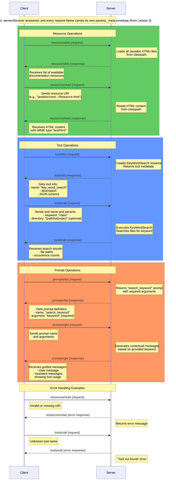

# MCP Message Flow - Lesson 4: Resources, Tools, and Prompts

This diagram shows the message flows for the three main capabilities implemented in lesson 4.

## Key Message Flows in Lesson 4

### Resources Flow
1. **List Resources**: Client discovers available Javadoc HTML documentation
2. **Read Resource**: Client retrieves specific HTML content by URI

### Tools Flow
1. **List Tools**: Client discovers the KeyWordSearch tool and its schema
2. **Call Tool**: Client executes keyword search with parameters

### Prompts Flow
1. **List Prompts**: Client discovers the search_keyword prompt template
2. **Get Prompt**: Client receives guided messages for tool usage

### Error Handling
- Resources: Handles missing or invalid resource URIs
- Tools: Handles unknown tool names gracefully
- All responses include proper error messages for debugging