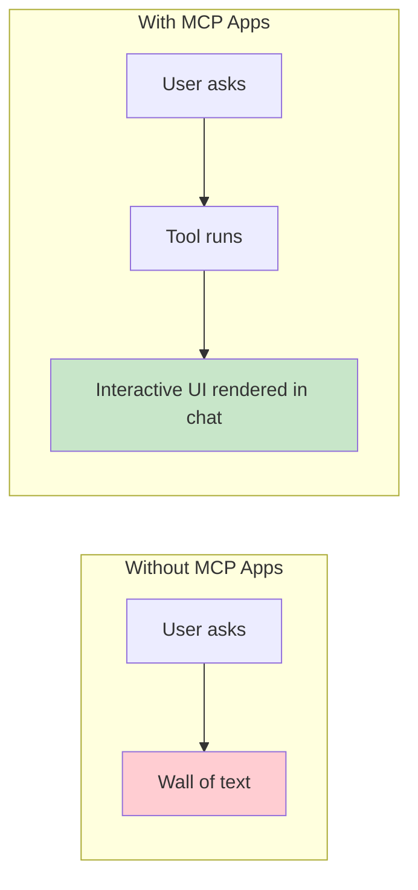
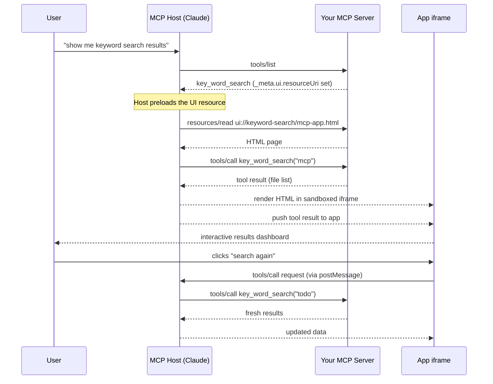

# Overview: MCP Apps — Interactive UI Inside the Conversation

## What Are MCP Apps?

Text responses can only go so far. **MCP Apps** let your server return an interactive HTML interface that renders directly inside the conversation — no new tab, no separate link, no context switch.

When a user asks "show me the keyword search results," instead of a wall of text they see a live, interactive dashboard right inside Claude or whatever MCP-compatible host they're using.



## Why Not Just Build a Web App?

You could build a standalone web app and send users a link. MCP Apps offer advantages a separate page cannot match:

| Advantage | What It Means |
|-----------|---------------|
| **Context preservation** | The UI lives inside the conversation. Users never switch tabs, lose their place, or wonder which chat thread had that dashboard. |
| **Bidirectional data flow** | The app can call any tool on your MCP server. A standalone web app would need its own API and auth. MCP Apps get this for free. |
| **Host integration** | The app can delegate actions to the host, which routes them through all the tools and connectors the user already has connected. |
| **Security** | MCP Apps run in a sandboxed iframe. They cannot access the parent page, steal cookies, or escape their container. |

If your use case is a simple static page, a regular web app is fine. If you want tight integration with the LLM conversation, MCP Apps are the right tool.

## The Core Pattern: Tool + Resource

MCP Apps combine two primitives you already know:

```
Tool  (with _meta.ui.resourceUri)
  +
Resource  (at a ui:// URI, returns HTML)
  =
Interactive App
```

The tool continues to work exactly as before — it runs, returns data, and the LLM interprets it. The only addition is a `_meta` field in the tool definition that points the host to an HTML resource it should also render.

## How It Works: Step by Step



## What You Add to the Protocol

To make a tool into an MCP App you add **three things**:

### 1. Declare the extension in `initialize`

The server's `initialize` response must advertise MCP Apps support in the `experimental` capabilities, just like elicitation:

```json
{
  "capabilities": {
    "experimental": {
      "io.modelcontextprotocol/apps": {}
    }
  }
}
```

The host checks this field during the handshake. If it is absent the host will not attempt to load or render your UI — the tool still works, but the app never appears.

### 3. `_meta` on the tool definition

```json
{
  "name": "key_word_search",
  "description": "Searches for a keyword across all project files.",
  "inputSchema": { "..." : "..." },
  "_meta": {
    "ui": {
      "resourceUri": "ui://keyword-search/mcp-app.html"
    }
  }
}
```

### 4. A resource handler for the `ui://` URI

When the host requests `ui://keyword-search/mcp-app.html` via `resources/read`, your server returns the bundled HTML. The host renders it in a sandboxed iframe.

The MIME type for MCP App resources is `application/vnd.mcp-ui.app+html`.

## The New Spec Objects

This lesson adds three new Java types to the workshop codebase that represent these protocol additions:

| Class | Purpose |
|-------|---------|
| `UiMeta` | Holds the `resourceUri` pointing to the `ui://` HTML resource |
| `AppMeta` | Wraps `UiMeta` as the `_meta` field on a tool |
| `AppTool` | A tool record that includes `_meta` alongside name, description, and inputSchema |

And a builder:

| Class | Purpose |
|-------|---------|
| `AppToolBuilder` | Fluent builder for constructing `AppTool` objects |

## When to Use MCP Apps

MCP Apps are a good fit when your use case involves:

- **Exploring complex data** — interactive maps, charts, tables with drill-down
- **Configuring with many options** — forms where users see all choices at once
- **Rich media** — embedded PDF viewers, 3D models, image previews
- **Real-time monitoring** — dashboards with live updates
- **Multi-step workflows** — approve/reject flows, step-by-step wizards

If your use case is answered well by a text response, you do not need MCP Apps.

## The Security Model

The app runs in a sandboxed iframe controlled by the host. It:
- Cannot access the parent window's DOM
- Cannot read the host's cookies or local storage
- Cannot navigate the parent page
- Communicates only through a controlled `postMessage` channel

This means hosts can safely render third-party apps without fully trusting the server author.

## Client Support

MCP Apps are supported by Claude (web), Claude Desktop, VS Code GitHub Copilot, Goose, Postman, and MCPJam. Any MCP-compatible host can add support using the `@mcp-ui/client` package or the App Bridge module from the `@modelcontextprotocol/ext-apps` SDK.

## Summary

MCP Apps extend the protocol you already understand — tools and resources — with one new idea: a tool can declare a UI resource, and the host renders that UI inside the conversation. The rest (sandboxing, communication, security) is handled by the host.

Your job as the server author is simple:

1. Declare `"io.modelcontextprotocol/apps"` in `experimental` during `initialize`
2. Add `_meta.ui.resourceUri` to your tool definition
3. Serve the HTML when the host requests it
4. Write the HTML app that presents your tool's data

Follow the instructions to see how to put this together.
