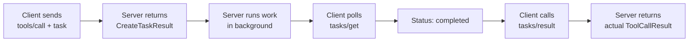
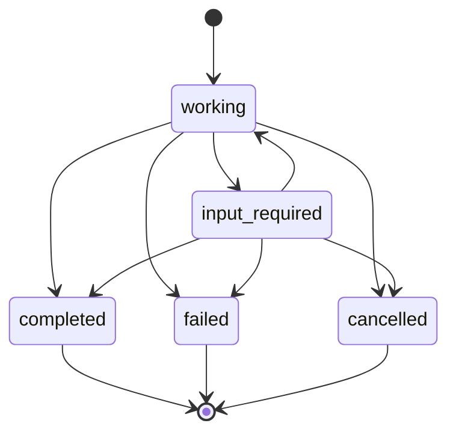

# Overview: Tasks — Call Now, Fetch Later

## Core Objective

Make the workshop server speak **MCP Tasks** — the 2025-11-25 spec utility that turns any expensive or long-running call into a poll-based workflow. Instead of holding a request open for minutes, your server immediately hands back a **task handle**, runs the actual work in the background, and lets the client poll, retrieve, or cancel on its own schedule.

> **Spec reference:** [tasks.mdx (MCP 2025-11-25)](https://modelcontextprotocol.io/specification/2025-11-25/basic/utilities/tasks) — introduced as [SEP-1686](https://github.com/modelcontextprotocol/modelcontextprotocol/issues/1686), still marked **experimental**.

## What Are Tasks?

A task is a **durable state machine** that lives inside the *receiver* (the side executing the work). It carries the current execution state plus the eventual result, and is uniquely addressable by a receiver-generated `taskId`.



The mental model: **request acceptance** and **request completion** are now two separate round trips. The first one is fast (milliseconds — just enough time to enqueue the work). The second one happens whenever the client cares to check.

## Why It Matters

| Concern | Without Tasks | With Tasks |
|---|---|---|
| Long-running tool call | Connection held open for minutes | Server responds in ms, client polls |
| Crash recovery | Result lost when connection drops | Result retrievable until TTL expires |
| Concurrent dispatch | One slow tool blocks the LLM | LLM keeps working while task runs |
| Batch workflows | Awkward — every call blocks | Native: dispatch many, collect later |
| Stateless HTTP transport | Requires server-sent events | Just pure request/response polling |

## The Lifecycle State Machine



Three terminal states (`completed`, `failed`, `cancelled`) — once there, a task never moves again. The receiver may delete a terminal task at any point after its TTL elapses.

## Capability Negotiation

Both sides declare what they implement during `initialize`. Server example:

```json
{
  "capabilities": {
    "tasks": {
      "list": {},
      "cancel": {},
      "requests": { "tools": { "call": {} } }
    }
  }
}
```

Client example (symmetric, but listing the operations the **client** can receive task-augmentation on):

```json
{
  "capabilities": {
    "tasks": {
      "list": {},
      "cancel": {},
      "requests": {
        "sampling":    { "createMessage": {} },
        "elicitation": { "create": {} }
      }
    }
  }
}
```

Empty `{}` objects are intentional — they are placeholders that may grow new sub-fields in future spec revisions. A category that is **absent** from `requests` cannot be task-augmented.

## Request Augmentation

Tasks do not introduce a new "create" RPC. Instead, the requestor appends a single `task` field to an existing eligible request:

```json
{
  "method": "tools/call",
  "params": {
    "name": "key_word_search",
    "arguments": { "keyword": "MCP" },
    "task": { "ttl": 60000 }
  }
}
```

The receiver then has two options:
1. **No `task` field present** → behave normally and return the actual result.
2. **`task` field present and the receiver advertised support** → return a `CreateTaskResult` and execute asynchronously.

## The Five New Methods

| Method | Direction | Purpose |
|---|---|---|
| *(none — augmentation only)* | requestor → receiver | Implicit "create task" by sending `task: {ttl}` on any eligible request. |
| `tasks/get` | requestor → receiver | Non-blocking poll. Returns the current `Task` snapshot. |
| `tasks/result` | requestor → receiver | Blocks until terminal. Returns exactly what the underlying request would have returned. |
| `tasks/list` | requestor → receiver | Cursor-paginated list of tasks visible to the requestor. |
| `tasks/cancel` | requestor → receiver | Best-effort cancel; rejects with `-32602` if the task is already terminal. |
| `notifications/tasks/status` | receiver → requestor | Optional push of a status change. Clients **MUST NOT** rely on receiving it — polling is the contract. |

## Related-Task Metadata

Every message belonging to a task lifecycle (other than `tasks/get` / `tasks/list` / `tasks/cancel`, which already name the task in params) carries this key in its `_meta`:

```json
"_meta": {
  "io.modelcontextprotocol/related-task": { "taskId": "786512e2-..." }
}
```

This is how an elicitation triggered *inside* a task's execution gets correlated back to the parent task — required for the `input_required` flow.

## Tool-Level `taskSupport`

Servers can advertise per-tool whether task augmentation is allowed:

```json
{
  "name": "key_word_search",
  "execution": { "taskSupport": "optional" }
}
```

Allowed values:
- `"required"` — client MUST task-augment calls to this tool.
- `"optional"` — client MAY task-augment.
- `"forbidden"` *(default)* — client MUST NOT.

This sits **in addition to** the server's `tasks.requests.tools.call` capability — both must agree before a tool can be invoked as a task.

## Error Codes Used

| Code | When |
|---|---|
| `-32602` Invalid params | Unknown `taskId`, unknown cursor, or cancel of an already-terminal task. |
| `-32603` Internal error | Server-side failures producing a task result. |
| `-32600` Invalid request | Receiver requires task augmentation for this method but the requestor did not augment. |

## What Students Will Achieve

By the end of this chapter you will have:

- ✅ Modeled the spec's records — `Task`, `TaskParams`, `CreateTaskResult`, `TasksCapability`, `ToolExecution`, etc. — as plain Java records.
- ✅ Added a `TaskStore` that keeps in-memory state, runs the underlying work on a background thread, and supports terminal-state callbacks.
- ✅ Wired the `IORouter` to detect `clientCapabilities.tasks`, advertise the server capability, and handle four new request methods plus one notification.
- ✅ Branched `tools/call` on the presence of a `task` field — returning `CreateTaskResult` when augmented and the existing synchronous `ToolCallResult` otherwise.
- ✅ Verified the end-to-end flow in MCP Inspector: create → poll → get-result → cancel.

## Stretch — Out of Scope for This Chapter

- Task augmentation of `sampling/createMessage` (server-as-requestor direction).
- Task augmentation of `elicitation/create`.
- Cursor-based pagination of `tasks/list`.
- Authorization-context binding (workshop is stdio-only with no auth).
- SSE-stream behavior described in the spec (workshop is stdio-only).
