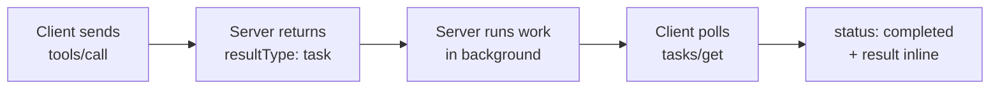
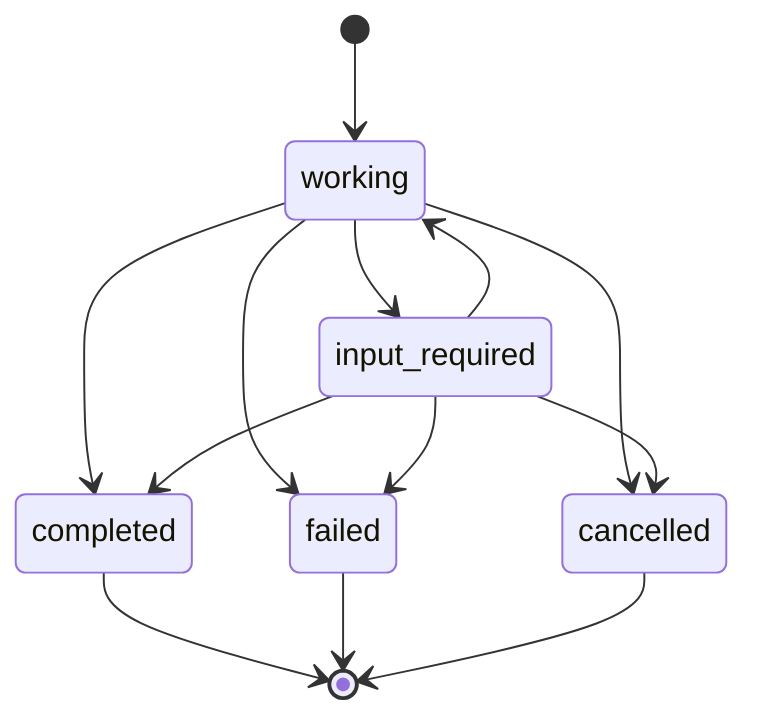

# Overview: Tasks — Call Now, Fetch Later

## Core Objective

Make the workshop server speak the **`io.modelcontextprotocol/tasks` extension** — the mechanism that turns any expensive or long-running call into a poll-based workflow. Instead of holding a request open for minutes, your server immediately hands back a **task handle**, runs the actual work in the background, and lets the client poll or cancel on its own schedule.

> **Spec reference:** tasks began life as [SEP-1686](https://github.com/modelcontextprotocol/modelcontextprotocol/issues/1686) and shipped as a core utility in `2025-11-25`. In `2026-07-28` it moved **out of the core protocol** and into an extension, and was reshaped substantially on the way.

## What Changed on 2026-07-28

Tasks were reshaped more than any other part of the protocol, so it is worth having the whole list up front:

| Before | Now |
|--------|-----|
| top-level `tasks` capability slot | `extensions["io.modelcontextprotocol/tasks"]` |
| client opts in with `params.task` | **server decides**; servers MUST ignore an inbound `task` field |
| `tasks/result` (blocking) | **removed** — poll `tasks/get` instead |
| `tasks/list` | **removed** |
| — | `tasks/update` (**new**) |
| `ttl` / `pollInterval` | `ttlMs` / `pollIntervalMs` |
| `notifications/tasks/status` | `notifications/tasks` |
| `_meta["…/related-task"]` wrapper | flat `taskId` |
| `tool.execution.taskSupport` | **removed** |

Each of those has a reason, and most of the reasons are the same reason: **there are no sessions any more.**

- A **blocking** `tasks/result` needs a session to block in. Polling does not.
- `tasks/list` would enumerate task ids, and with no session to scope a task to, a task id's only access control is the entropy of its UUID. A listing is a leak.
- The `related-task` `_meta` wrapper existed to correlate messages back to a parent task. Messages now name the `taskId` directly.
- `taskSupport` and `params.task` both let the *client* decide when a task was created. The server decides now.

## What Are Tasks?

A task is a **durable state machine** that lives inside the *receiver* — the side executing the work. It carries the current execution state plus the eventual result, and is uniquely addressable by a receiver-generated `taskId`.



The mental model: **request acceptance** and **request completion** are two separate round trips. The first is fast — just long enough to enqueue the work. The second happens whenever the client cares to check.

Note that the final poll returns the underlying result *inline*. There is no second call to fetch it, because `tasks/result` is gone.

## Why It Matters

| Concern | Without Tasks | With Tasks |
|---|---|---|
| Long-running tool call | Connection held open for minutes | Server responds in ms, client polls |
| Crash recovery | Result lost when connection drops | Result retrievable until TTL expires |
| Concurrent dispatch | One slow tool blocks the LLM | LLM keeps working while task runs |
| Batch workflows | Awkward — every call blocks | Native: dispatch many, collect later |
| Stateless transport | Requires a server-push channel | Pure request/response polling |

## The Lifecycle State Machine



Three terminal states — `completed`, `failed`, `cancelled` — and once there a task never moves again. The receiver may delete a terminal task any time after its TTL elapses.

## Capability Negotiation

There is no `tasks` capability object to fill in any more. Both sides declare the extension by identifier, and an empty `{}` means "supported, no settings".

Server, in its `server/discover` result:

```json
{
  "capabilities": {
    "extensions": {
      "io.modelcontextprotocol/tasks": {}
    }
  }
}
```

Client, in **every request's** `_meta` envelope:

```json
"_meta": {
  "io.modelcontextprotocol/clientCapabilities": {
    "extensions": { "io.modelcontextprotocol/tasks": {} }
  }
}
```

That difference in *where* the two live is the important part. The server declares once, at discovery. The client re-declares on every single request — so the question "may this client be handed a task?" is a question about **the request being answered**, never about a connection.

## Task Creation Is the Server's Decision

Tasks no longer introduce anything into the request. There is no `task` field to append, and a server MUST ignore one if a legacy client sends it.

The receiver decides per call, and only ever hands a handle to a client that declared the extension on that very request:

```java
private boolean answersWithTask(RequestEnvelope envelope) {
    return TASK_HANDLES_ENABLED && envelope.supportsTasks();
}
```

Handing a task to a client that will not poll strands the work forever, which is why the second half of that condition is not optional.

## The Three Methods

| Method | Direction | Purpose |
|---|---|---|
| `tasks/get` | requestor → receiver | Non-blocking poll. Returns the task snapshot, plus `result` when completed, `error` when failed, or `inputRequests` when input is required. |
| `tasks/update` | requestor → receiver | **New.** Delivers `inputResponses` to a task sitting in `input_required` — its only job. |
| `tasks/cancel` | requestor → receiver | Best-effort cancel; `-32602` if the task is already terminal. |
| `notifications/tasks` | receiver → requestor | Optional push of a status change. Clients **MUST NOT** rely on receiving it — polling is the contract. |

`tasks/result` and `tasks/list` are **removed**, and removal in this revision is physical: sending either one gets `-32601`, not a polite refusal.

## A Handle or a Question — Never Both

This is the subtlest point in the chapter, and the one most likely to bite.

`resultType` holds **one** value. So the response to a `tools/call` is *either* a task handle *or* an `input_required` — never one and then the other. That forces an ordering on your handler: **commit to the answer shape before the tool works out what it is missing.**

Get it backwards and a task-declaring client receives an `input_required`, which the Inspector rejects outright:

> Unsupported result type `input_required` for `tools/call`: multi-round-trip auto-fulfilment is not enabled on this instance

Nothing is lost by committing early, because a task has its own way to ask. The question moves off the call and onto the task, where it surfaces as an `input_required` **status** that a client sees when it polls:

```json
{"resultType":"complete","status":"input_required",
 "inputRequests":{"search_directory":{"method":"elicitation/create",
                                      "params":{"mode":"form","message":"…","requestedSchema":{ … }}}}}
```

and answers with `tasks/update`:

```json
{"method":"tasks/update",
 "params":{"taskId":"3dab39bc-…",
           "inputResponses":{"search_directory":{"action":"accept",
                                                 "content":{"directory":"/path/to/repo"}}}}}
```

Same MRTR vocabulary as Chapter 5 — `inputRequests`, `inputResponses`, keyed by the server's own labels. The difference is the carrier: a synchronous call is retried under a new id and needs a `requestState` to carry its continuation, whereas a task already **has** an identity, so the `taskId` does the correlating and no `requestState` is needed.

## Error Codes Used

| Code | When |
|---|---|
| `-32601` Method not found | `tasks/result` or `tasks/list` — removed from the protocol. |
| `-32602` Invalid params | Unknown `taskId`, cancelling an already-terminal task, or `tasks/update` on a task that is not waiting for input. |
| `-32603` Internal error | Server-side failure while producing a task result. |

Note that `tasks/get` returns `resultType: "complete"` even when the *task* has failed. The poll succeeded; the work did not. Keeping those distinct is what lets a client tell a broken task from a broken protocol.

## What Students Will Achieve

By the end of this chapter you will have:

- ✅ Declared tasks as an **extension**, not a capability slot
- ✅ Modeled the reshaped records — `Task`, `TaskResult`, `TasksGetParams`, `TasksUpdateParams`, `TasksCancelParams` — as plain Java records, with `ttlMs` / `pollIntervalMs`
- ✅ Built a framework-free `TaskStore` with status callbacks and a full `input_required` lifecycle
- ✅ Wired `IORouter` to handle three methods and emit `notifications/tasks`
- ✅ Made task creation a **server** decision, gated on what the client declared on that request
- ✅ Committed to the answer shape before asking anything, so a handle and a question never collide
- ✅ Implemented the task-level round trip, where the question is a status and `tasks/update` is the answer
- ✅ Verified end to end in MCP Inspector: handle → poll → input_required → update → completed, plus cancel

## Stretch — Out of Scope for This Chapter

- Task-augmenting an `elicitation/create` embedded in an `input_required`
- Persisting tasks beyond process lifetime
- Authorization-context binding (workshop is stdio-only with no auth)
- Multiple concurrent tasks per client and any fairness policy between them
