# MCP Communication Flow Diagram

Based on the log file `agent-mcp-workshop-33408.log`, here's a flow diagram showing the MCP (Model Context Protocol) communication between the client and server.

```mermaid
sequenceDiagram
    participant Client as MCP Inspector<br/>(Client)
    participant Server as Agent MCP Workshop<br/>(Server)
    participant Builders as com.workshop.mcp.spec.builders
    
    Note over Client,Server: Initialization Phase
    
    Client->>Server: initialize<br/>{"method": "initialize", "params": {<br/>"protocolVersion": "2025-03-26",<br/>"capabilities": {"sampling": {}, "roots": {"listChanged": true}},<br/>"clientInfo": {"name": "mcp-inspector", "version": "0.14.0"}}}
    
    Note right of Server: Server uses InitializeResultBuilder<br/>to construct response
    Server-->>Builders: InitializeResultBuilder.build()
    
    Server->>Client: initialize result<br/>{"protocolVersion": "2025-03-26",<br/>"capabilities": {"tools": {"listChanged": true},<br/>"prompts": {"listChanged": true},<br/>"resources": {"listChanged": false, "subscribe": false}},<br/>"serverInfo": {"name": "agent-mcp-workshop", "version": "0.0.1"}}
    
    Client->>Server: notifications/initialized
    
    Server->>Client: roots/list<br/>(Server-initiated request)
    Client->>Server: roots/list result<br/>{"roots": []}
    
    Note over Client,Server: Resource Discovery Phase
    
    Client->>Server: resources/list
    
    Note right of Server: Server uses ResourcesListResultBuilder<br/>to build list of Javadoc resources
    Server-->>Builders: ResourcesListResultBuilder<br/>.addResource(ResourceBuilder)
    
    Server->>Client: resources/list result<br/>[List of 73 Javadoc resources including<br/>Capability.html, Completion.html, builders/*.html]
    
    Client->>Server: resources/read<br/>{"uri": "javadoc/com/workshop/mcp/spec/Capability.html"}
    
    Note right of Server: Server uses ReadResourceResultBuilder
    Server-->>Builders: ReadResourceResultBuilder.build()
    
    Server->>Client: Capability.html content
    
    Client->>Server: resources/read<br/>{"uri": "javadoc/com/workshop/mcp/spec/Completion.html"}
    Server->>Client: Completion.html content
    
    Note over Client,Server: Prompts Discovery Phase
    
    Client->>Server: prompts/list
    
    Note right of Server: Server uses PromptsListResultBuilder
    Server-->>Builders: PromptsListResultBuilder<br/>.addPrompt(PromptBuilder)
    
    Server->>Client: prompts/list result<br/>[{"name": "search_keyword",<br/>"description": "Creates a prompt to search...",<br/>"arguments": [{"name": "keyword", "required": true}]}]
    
    Note over Client,Server: Roots Update Notification
    
    Server->>Client: notifications/roots/list_changed
    Server->>Client: roots/list
    Client->>Server: roots/list result<br/>{"roots": [{"uri": "/Users/davidparry/code/gold/agent-mcp-workshop"}]}
    
    Note over Client,Server: Tools Discovery Phase
    
    Client->>Server: tools/list
    
    Note right of Server: Server uses ToolsListResultBuilder
    Server-->>Builders: ToolsListResultBuilder<br/>.addTool(ToolBuilder)
    
    Server->>Client: tools/list result<br/>[{"name": "key_word_search",<br/>"description": "Searches for a specified keyword...",<br/>"inputSchema": {...}}]
    
    Note over Client,Server: Tool Execution Phase
    
    Client->>Server: tools/call<br/>{"name": "key_word_search", "arguments": {"keyword": "java"}}
    
    Note right of Server: Server uses ToolCallResultBuilder
    Server-->>Builders: ToolCallResultBuilder<br/>.addContent(...)
    
    Server->>Client: tool result<br/>[Multiple file paths with keyword counts]
    
    Note over Client,Server: Completion Phase
    
    Client->>Server: completion/complete<br/>{"argument": {"name": "keyword", "value": "jav"},<br/>"ref": {"type": "ref/prompt", "name": "search_keyword"}}
    
    Note right of Server: Server uses CompletionCompleteBuilder
    Server-->>Builders: CompletionCompleteBuilder.build()
    
    Server->>Client: completion result<br/>{"completion": {"values": ["java", "the", "and"]},<br/>"total": 3, "hasMore": true}
    
    Client->>Server: completion/complete<br/>{"argument": {"name": "keyword", "value": "java"}}
    Server->>Client: completion result
    
    Note over Client,Server: Prompt Execution Phase
    
    Client->>Server: prompts/get<br/>{"name": "search_keyword", "arguments": {"keyword": "java"}}
    
    Note right of Server: Server uses PromptsGetResultBuilder
    Server-->>Builders: PromptsGetResultBuilder<br/>.addMessage(...)
    
    Server->>Client: prompt result<br/>{"messages": [{"role": "user",<br/>"content": {"text": "Start from the root..."}}]}
    
    Note over Client,Server: Health Check & Sampling
    
    Client->>Server: ping
    Server->>Client: ping result {}
    
    Server->>Client: sampling/createMessage<br/>(Server-initiated)
    
    Note right of Server: Server uses CreateSamplingMessageBuilder
    Server-->>Builders: CreateSamplingMessageBuilder<br/>.addMessage(...)
    
    Client->>Server: sampling result<br/>{"model": "stub-model", "role": "assistant",<br/>"content": {"text": "LLM response for your java"}}
    
    Note over Client,Server: Shutdown
    Server-->>Server: Stopping and closing resources
```

## Key Components and Builders Used

### com.workshop.mcp.spec.builders Package

The server extensively uses builder classes to construct responses:

1. **InitializeResultBuilder** - Builds initialization response with server capabilities
2. **ResourcesListResultBuilder** - Constructs list of available resources (Javadoc files)
3. **ResourceBuilder** - Creates individual resource entries
4. **ReadResourceResultBuilder** - Builds responses for resource read requests
5. **PromptsListResultBuilder** - Constructs list of available prompts
6. **PromptBuilder** - Creates individual prompt definitions
7. **ToolsListResultBuilder** - Builds list of available tools
8. **ToolBuilder** - Creates individual tool definitions
9. **ToolCallResultBuilder** - Constructs results from tool executions
10. **CompletionCompleteBuilder** - Builds completion/autocomplete responses
11. **PromptsGetResultBuilder** - Constructs expanded prompt content
12. **CreateSamplingMessageBuilder** - Builds sampling message requests

## Communication Patterns

1. **Request-Response**: Most interactions follow a standard request-response pattern
2. **Server-Initiated**: Some messages like `roots/list` and `sampling/createMessage` are initiated by the server
3. **Notifications**: The server sends notifications like `roots/list_changed` to inform about state changes
4. **Progress Tokens**: Each request includes a `progressToken` for tracking

## Resource Types Exposed

- **Javadoc HTML files**: Documentation for all MCP spec classes and builders
- **Tools**: `key_word_search` tool for searching keywords in files
- **Prompts**: `search_keyword` prompt template for keyword searches
- **Roots**: Project root directory for file access